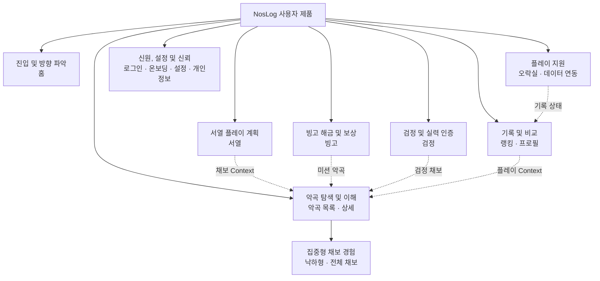

# NosLog 2.0 사용자 정보 구조 및 내비게이션

## 문서 관리

- 상태: `승인`
- 근거 상태: `현재 제품 감사, 저장소 확인, 브라우저 근거 및 인용한 내비게이션 가이드`
- 작성 시작일: 2026-07-29
- 승인일: 2026-07-30
- 문서 언어: 한국어 동기화본
- 영어 원본: [02-information-architecture.md](./02-information-architecture.md)
- 입력 감사 문서:
  [01-current-product-audit.ko.md](./01-current-product-audit.ko.md)
- 범위: NosLog 2.0 사용자 페이지 패밀리, 정보 구조, 내비게이션 및 중요한
  페이지 간 흐름
- 제외 범위: 관리자 인터페이스 재설계, 페이지 단위 시각 구성, 컴포넌트 스타일
  및 최종 경로 마이그레이션

## 결정 상태 표기

- **확정:** 사용자와 명시적으로 합의했으며 후속 요구사항으로 사용할 수 있습니다.
- **관찰:** 현재 제품, 저장소 또는 브라우저에서 확인했습니다.
- **제안:** 논의를 위한 추천이며 구현 승인을 받지 않았습니다.
- **미확정:** 조사, 테스트 또는 사용자 결정이 필요합니다.

이 문서에 내비게이션 또는 그룹 제안이 작성되어 있다는 이유만으로 승인된 것으로
간주하지 않습니다.

## 목적

이 문서는 페이지 기획서나 시각 디자인을 시작하기 전에 v1.6.0 기능 인벤토리를
사용자 중심 구조로 변환합니다. 다음 조건을 충족해야 합니다.

1. 유지하는 모든 사용자 기능에 명확한 위치를 부여합니다.
2. 페이지 패밀리와 전역 내비게이션 목적지를 구분합니다.
3. 보조 기능을 삭제하지 않으면서 가장 중요한 과업을 우선합니다.
4. 사용자가 관련 페이지 사이를 이동하는 방법을 정의합니다.
5. Figma 또는 구현 전에 미해결 내비게이션 결정을 드러냅니다.

## 확정된 입력

- **확정:** 홈은 가장 중요한 첫 진입 경험입니다. 사용자가 어디로 이동할지
  파악하고 중요한 정보를 즉시 얻을 수 있어야 합니다.
- **확정:** 악곡 탐색과 악곡 상세는 자주 사용하는 핵심 흐름입니다.
- **확정:** 서열표는 핵심 플레이 계획 흐름입니다.
- **확정:** 현재 제거하거나 보류하기로 예정된 사용자 기능은 없습니다.
- **확정:** 보조 기능을 다시 묶거나 점진적으로 공개할 수 있지만 기능과 발견
  가능성을 보존해야 합니다.
- **확정:** 관리자 인터페이스 재설계는 NosLog 2.0 사용자 화면 범위 밖이며
  2.0 이후에 진행할 수 있습니다.
- **확정:** 한국어, 일본어 및 영어 사용자 경로는 언어 Prefix URL을 유지합니다.
- **확정:** 모바일이 주요 사용 환경이지만 데스크톱도 필수 반응형 대상입니다.
- **확정:** 일반 페이지는 고정 하단 내비게이션이 아닌 반응형 상단 헤더를
  사용합니다. 헤더 왼쪽에는 NosLog 정체성, 오른쪽에는 프로필·계정 컨트롤과
  더보기 컨트롤만 둡니다.
- **확정:** 더보기 컨트롤은 서로 독립된 이동 블록을 엽니다. 서열, 빙고 및
  검정은 서로 다른 NOSTALGIA 콘텐츠이며 통합 라벨이나 통합 Landing Page
  아래에 배치하면 안 됩니다.
- **확정:** 비로그인 사용자는 헤더의 계정 위치에서 보이는 **로그인** Text
  Button을 사용합니다.
- **확정:** 홈에는 사용자가 각 서비스 기능으로 빠르게 이동할 수 있는 Grid형
  직접 내비게이션 블록을 유지합니다.
- **확정:** 채보 뷰어는 홈과 더보기 Panel에서 직접 찾을 수 있는 목적지로
  유지하지만, 중복 검색 페이지를 만들지 않고 공용 악곡 검색 Surface를
  채보 검색 범위로 엽니다.
- **확정:** 악곡 검색과 공개 채보 검색은 하나의 검색 Surface를 공유합니다.
  검색창 안쪽의 간결한 선행 범위 선택기로 두 검색을 전환합니다.
- **확정:** 간결한 문맥 선택기나 점진적 공개로 같은 기능과 발견 가능성을
  보존할 수 있다면 모드·필터 버튼 행을 상시 누적하지 않습니다.
- **확정:** 홈에 오래된 연동, 최근 플레이 또는 미완료 콘텐츠를 보여주는 로그인
  사용자 개인화 카드를 추가하지 않습니다.
- **확정:** 피드백·오류 제보는 홈에서 제거하고 더보기 Panel의 일관된 지원
  영역에서 제공합니다. 현재 Dialog 제출 흐름은 유지하며 집중형 채보 뷰어의
  접근 방식은 이후 뷰어 페이지 기획서에서 결정합니다.
- **확정:** 일반 NosLog 공지와 NOSTALGIA 공식 소식은 핵심 검색·이동·데이터
  연동 과업 다음에 오는 홈의 낮은 우선순위 편집 콘텐츠로 유지합니다. 홈은
  최신 일반 공지 세 건을 제목·게시일 Link로 표시한 뒤 최신 공식 X 게시물
  하나를 표시합니다.
- **확정:** 개인정보처리방침과 GitHub는 푸터 목적지로 유지하고 더보기
  Panel에 중복 배치하지 않습니다.
- **확정:** 설정은 비로그인·로그인 사용자가 함께 접근하는 하나의 공개
  목적지입니다. 비로그인 사용자는 기기 단위 이용 환경을 설정하고, 로그인
  사용자는 추가 프로필·계정 설정을 확인합니다.
- **관찰:** 채보 뷰어는 일반 콘텐츠 페이지와 다른 너비 및 컨트롤 모델이
  필요합니다.
- **확정:** 채보 뷰어는 집중형 셸을 사용하고, 낙하형·포물선 채보 뷰어에는
  전체 화면 진입과 종료 기능을 제공합니다.

## 참고 근거

| 출처                                                                                                                  | 가져올 원칙                                                                                                                            | NosLog 적용                                                                                                                                      | 한계                                                                               |
| --------------------------------------------------------------------------------------------------------------------- | -------------------------------------------------------------------------------------------------------------------------------------- | ------------------------------------------------------------------------------------------------------------------------------------------------ | ---------------------------------------------------------------------------------- |
| [W3C WCAG 2.2: Multiple Ways](https://www.w3.org/WAI/WCAG22/Understanding/multiple-ways)                              | 사용자는 페이지 집합 안의 콘텐츠를 두 가지 이상의 방법으로 찾을 수 있어야 합니다.                                                      | 중요한 악곡, 서열, 랭킹, 빙고, 검정 및 프로필은 홈 Grid, 더보기 Panel, 검색 또는 문맥 링크를 통해 접근할 수 있어야 합니다.                       | 특정 내비게이션 컴포넌트를 지정하지 않습니다.                                      |
| [W3C WCAG 2.2: Consistent Navigation](https://www.w3.org/WAI/WCAG22/Understanding/consistent-navigation.html)         | 반복되는 내비게이션은 동일한 상대적 순서를 유지해야 합니다.                                                                            | 모바일과 데스크톱의 레이아웃이 달라도 목적지 의미와 상대적 순서는 예측 가능해야 합니다.                                                          | 문서화하고 검증한 집중형 Context에서는 의도적으로 축소된 셸을 사용할 수 있습니다.  |
| [W3C WCAG 2.2: Consistent Identification](https://www.w3.org/WAI/WCAG22/Understanding/consistent-identification.html) | 반복되는 기능은 일관된 라벨과 식별을 사용해야 합니다.                                                                                  | 검색, 연동, 프로필, 채보 뷰어 및 내비게이션 라벨은 ko, ja, en에서 의미적으로 일관돼야 합니다.                                                    | 번역 길이에 따라 시각적 공간은 달라질 수 있지만 의미를 바꾸면 안 됩니다.           |
| [W3C WCAG 2.2: Bypass Blocks](https://www.w3.org/WAI/WCAG22/Understanding/bypass-blocks)                              | 순차 탐색 사용자는 반복되는 내비게이션을 건너뛸 수 있어야 합니다.                                                                      | 내비게이션이 풍부해져도 건너뛰기 링크와 의미 있는 Landmark를 유지합니다.                                                                         | 접근성 요구사항이며 시각적 레이아웃 추천은 아닙니다.                               |
| [GOV.UK: Navigate a service](https://design-system.service.gov.uk/patterns/navigate-a-service/)                       | 내비게이션은 가장 유용한 최상위 섹션으로 연결해야 하며 사이트맵이 되어서는 안 됩니다.                                                  | NosLog 전역 내비게이션에는 자주 사용하는 목적지만 간결하게 노출하고, 유지하는 모든 기능에 같은 전역 비중을 줄 필요는 없습니다.                   | 공공 서비스 Context이므로 시각 패턴은 NosLog 아트 디렉션 레퍼런스가 아닙니다.      |
| [GOV.UK: Service navigation](https://design-system.service.gov.uk/components/service-navigation/)                     | 서비스 정체성과 내비게이션 메뉴를 하나의 상단 시스템에 유지하면서 좁은 너비에서는 여러 내비게이션 항목을 메뉴 안으로 접을 수 있습니다. | NosLog 정체성과 더보기 컨트롤을 안정적인 상단 헤더에 유지하고 이동 블록 Panel을 사용 가능한 너비에 맞게 조정합니다.                              | 컴포넌트의 브랜딩과 정확한 시각 표현은 NosLog에 적용하지 않습니다.                 |
| [USWDS: Header](https://designsystem.digital.gov/components/header/)                                                  | 헤더는 사이트를 식별하고 주요 섹션으로 체계적으로 이동하게 하며, 단순·확장 Variant가 사용 가능한 너비에 반응합니다.                    | 좁은 헤더에 라벨을 강제로 넣지 않고 절제된 헤더 셸과 이동 블록을 가진 더보기 Panel을 사용합니다.                                                 | USWDS는 구현 레퍼런스이며 시각 스타일 출처가 아닙니다.                             |
| [Carbon: Global header](https://carbondesignsystem.com/patterns/global-header/)                                       | 단순한 제품은 헤더 중심 셸을 사용할 수 있고, 셸 구성은 정보 깊이에 맞춰야 합니다.                                                      | 모바일 전용 하단 모델을 추가하지 않고 모바일과 데스크톱에서 하나의 의미적 상단 헤더 모델을 유지하며 열린 Panel을 조정합니다.                     | Carbon은 Enterprise 제품 대상이므로 구조만 참고합니다.                             |
| [Carbon: Disclosures](https://carbondesignsystem.com/patterns/disclosures-pattern/)                                   | 프로필·더보기 메뉴는 과밀해지지 않으면서 간결한 전역 내비게이션과 설정을 제공해야 합니다.                                              | 제품 목적지 다음에 설정과 피드백을 간결한 유틸리티 항목으로 두고 푸터 링크나 전체 설정 컨트롤을 Panel 안에 중복하지 않습니다.                    | Carbon의 Enterprise 예시는 NosLog의 시각 스타일이나 정확한 라벨을 정하지 않습니다. |
| [Figma: UI design principles](https://www.figma.com/resource-library/ui-design-principles/)                           | 계층과 점진적 공개는 사용자의 필요에 맞춰 가시적 우선순위를 정해야 합니다.                                                             | 홈 모듈과 보조 유틸리티를 같은 비중으로 배치하지 않고 과업 중요도에 따라 정렬합니다.                                                             | 원칙을 제공할 뿐 NosLog에 특화된 근거는 아닙니다.                                  |
| [W3C: Guiding users to translated pages](https://www.w3.org/International/questions/qa-site-conneg)                   | 자동 언어 협상에는 수동 선택 수단이 함께 있어야 하며 사용자의 명시적 선택을 기억해야 합니다.                                           | 공개 설정에서 비로그인 사용자에게도 언어 선택을 제공하고 명시적인 브라우저 단위 선택을 유지합니다.                                               | 언어 선택 지침이며 전체 설정 정보 구조를 다루지는 않습니다.                        |
| [Google Search settings](https://www.google.com/preferences)                                                          | 공개 설정 Surface는 로그인 전에도 언어·테마·브라우저 단위 이용 환경 설정을 제공할 수 있습니다.                                         | NosLog의 언어, 테마 및 번역 제목 표시는 계정 전용 컨트롤이 아니라 유효한 비로그인 설정입니다.                                                    | Google 검색은 더 넓은 설정과 다른 개인화 모델을 가집니다.                          |
| [YouTube: Change language or location settings](https://support.google.com/youtube/answer/87604)                      | 서비스는 비로그인 상태의 명시적 언어 선택을 브라우저에 저장하고 사이트 전체에 적용할 수 있습니다.                                      | 비로그인 표시 설정은 브라우저에 유지하고 계정 고유 컨트롤만 로그인 상태에 둡니다.                                                                | YouTube는 일부 설정을 공개 설정 페이지가 아니라 프로필 메뉴에서 직접 제공합니다.   |
| [GNU: Select language](https://www.gnu.org/server/select-language.en.html)                                            | 비로그인 선택은 계정 없이도 범위가 제한된 Cookie를 통해 브라우저 기본값을 덮어쓸 수 있습니다.                                          | 자동 Locale 감지를 초기 기본값으로만 사용하고 공개 수동 설정의 대체 수단으로 취급하지 않습니다.                                                  | 단일 목적의 언어 컨트롤이며 전체 앱 설정 모델은 아닙니다.                          |
| [GOV.UK: Footer](https://design-system.service.gov.uk/components/footer/)                                             | 푸터는 보조 서비스·정책 링크의 안정적인 위치로 적합합니다.                                                                             | 과업 중심 더보기 Panel에 중복하지 않고 개인정보처리방침을 푸터에 유지합니다.                                                                     | 정부 서비스의 정확한 푸터 콘텐츠와 시각 표현은 적용하지 않습니다.                  |
| [USWDS: Footer](https://designsystem.digital.gov/components/footer/)                                                  | 푸터 콘텐츠는 주요 내비게이션과 경쟁하지 않으면서 신뢰와 보조 정보를 지원해야 합니다.                                                  | 개인정보처리방침과 외부 GitHub 프로젝트 링크를 푸터에 두고 핵심 목적지 계층에서 제외합니다.                                                      | 모든 제품에 GitHub가 필요하다고 규정하는 자료는 아닙니다.                          |
| [Apple: Search fields](https://developer.apple.com/design/human-interface-guidelines/search-fields)                   | 명확히 구분되는 검색 범주는 범위 컨트롤을 사용할 수 있으며 검색창이나 결과 영역은 검색 가능한 대상을 전달해야 합니다.                  | 하나의 악곡 검색 Surface에서 악곡·채보 범위를 전환하고 검색창 단서와 결과 동작을 함께 변경합니다.                                                | Apple 플랫폼 컴포넌트의 시각 스타일을 NosLog에 그대로 복사하지 않습니다.           |
| [Baymard: Search scope](https://baymard.com/blog/search-scope)                                                        | 수동 범위 선택기는 의미가 명확하고 검색창보다 부차적이며 검색창 가까이에 있어야 합니다.                                                | 검색창 위에 상시 검색 모드 버튼 행을 추가하지 않고 검색창 안쪽에 간결한 선행 선택기를 둡니다.                                                    | 전자상거래 연구이므로 범위 명확성 원칙만 가져옵니다.                               |
| [W3C APG: Accessible names](https://www.w3.org/WAI/ARIA/apg/practices/names-and-descriptions/)                        | 상호작용 컨트롤에는 접근 가능한 이름이 필요하며 목적을 명확히 할 수 있다면 보이는 Text를 선호합니다.                                   | 아이콘 범위 선택기에 접근 가능한 이름과 확장 상태를 제공하고 열린 메뉴에는 Text 라벨을 표시하며 검색창 단서와 결과에서도 활성 범위를 보강합니다. | 접근 가능한 이름만으로 익숙하지 않은 아이콘의 시각적 이해가 검증되지는 않습니다.   |

## 현재 내비게이션 모델

### 관찰된 전역 Surface

| Surface              | 현재 목적지 또는 역할                                                   | 현재 우선순위 신호                                                                              |
| -------------------- | ----------------------------------------------------------------------- | ----------------------------------------------------------------------------------------------- |
| 브랜드 링크          | 홈                                                                      | NosLog Wordmark를 통해 홈으로 갈 수 있지만 주요 내비게이션 항목으로 이름이 표시되지는 않습니다. |
| 주요 헤더 내비게이션 | 악곡, 랭킹, 서열                                                        | 세 목적지는 항상 직접 접근할 수 있습니다.                                                       |
| 보조 메뉴            | 빙고, 검정, 오락실, 데이터 연동 및 권한이 있을 때 관리자 진입           | 메뉴를 열어야 접근할 수 있습니다.                                                               |
| 사용자 컨트롤        | 로그인 상태에서는 아바타를 통한 공개 프로필, 비로그인 상태에서는 로그인 | 신원 및 계정 접근은 콘텐츠 내비게이션과 시각적으로 분리됩니다.                                  |
| 홈 검색              | 검색어를 악곡 페이지로 전달하는 악곡 탐색                               | 현재 가장 빠른 악곡 진입 경로입니다.                                                            |
| 홈 바로가기 Grid     | 악곡, 랭킹, 빙고, 서열, 검정, 오락실                                    | 여섯 기능이 거의 동일한 시각적 비중을 가집니다.                                                 |
| 홈 유틸리티 행       | 데이터 연동                                                             | 바로가기 Grid와 분리되어 있지만 항상 표시됩니다.                                                |
| 홈 하단 콘텐츠       | 피드백과 NOSTALGIA 공식 소식                                            | 제품 바로가기 다음에 보조 콘텐츠가 이어집니다.                                                  |
| 푸터                 | 개인정보처리방침과 GitHub                                               | 신뢰 및 외부 프로젝트 정보입니다.                                                               |

### 관찰된 구조적 증상

- 홈의 여섯 바로가기 타일은 현재 비슷한 시각적 비중을 가집니다. 정확한 계층은
  홈 페이지 기획서 결정으로 남기지만 Grid 자체는 승인된 내비게이션 수단입니다.
- 홈은 NosLog 정체성을 통해 전역에서 접근할 수 있으며 헤더에 두 번째 이름
  링크가 필요하지 않습니다.
- 현재 헤더의 악곡, 랭킹 및 서열은 NosLog 2.0에서 더보기 이동 블록과 홈
  Grid로 이동하고, 헤더 자체는 시각적으로 간결하게 유지합니다.
- 데이터 연동, 피드백 및 공식 소식은 유용하지만 항상 독립적인 홈 블록으로
  표시되면 핵심 첫 진입 과업과 경쟁합니다.
- 현재 보조 메뉴는 빙고, 검정, 오락실 및 데이터 연동을 이미 별개의 링크로
  유지합니다. 재설계한 더보기 Panel도 이 분리를 유지하면서 반응형 블록
  레이아웃을 개선해야 합니다.
- 악곡 상세, 서열 항목, 검정 스테이지, 프로필 기록 및 랭킹 항목은 이미
  악곡으로 향하는 문맥 경로를 만듭니다. 이 관계를 전역 내비게이션만으로
  대체해서는 안 됩니다.

## 제안하는 사용자 페이지 패밀리

페이지 패밀리는 관련된 사용자 목표와 화면 Template을 묶습니다. 자동으로 전역
내비게이션 라벨이 되는 것은 아닙니다.

| 페이지 패밀리      | 사용자의 질문 또는 목표                                        | 포함 경로와 기능                                                                                                                | 확정 또는 제안 관계                                 |
| ------------------ | -------------------------------------------------------------- | ------------------------------------------------------------------------------------------------------------------------------- | --------------------------------------------------- |
| 진입 및 방향 파악  | “어디로 이동하고 어떤 정보를 즉시 확인할 수 있는가?”           | 홈, 일반 공지 요약, 다국어 공지 Archive·상세, 전역 악곡 검색, 직접 이동 블록, 공식 소식, 피드백 진입                            | 주요 진입 및 이동 허브                              |
| 악곡 탐색 및 이해  | “어떤 악곡을 찾고 있으며, 이 채보와 기록은 무엇을 의미하는가?” | 악곡 검색·목록, 악곡 상세, 난이도 전환, 채보 정보, 개인 기록, 채보 랭킹, 평가, 공개 채보 뷰어                                   | 핵심 제품 패밀리                                    |
| 서열 플레이 계획   | “이 목표에서 다음에 어떤 채보를 플레이할 것인가?”              | 서열표, 모드·목표 선택, 필터, 서열 구간, 개인 기록 Context                                                                      | 독립적인 NOSTALGIA 관련 플레이 계획 콘텐츠          |
| 빙고 해금 및 보상  | “어떤 빙고 진행으로 악곡을 해금하거나 NOS를 얻는가?”           | 빙고 목록·상세, 5×5 미션, 줄·칸 진행도, 악곡 해금 및 NOS 보상 Context                                                           | 일반 도전 Branch가 아닌 독립적인 NOSTALGIA 콘텐츠   |
| 검정 및 실력 인증  | “내 실력은 어느 수준이며 어떤 칭호를 획득할 수 있는가?”        | 검정 선택, 요구조건, 스테이지, 허용 채보, 시뮬레이션·조언, NOS 사용, 칭호·보상 및 증빙 제출                                     | 독립적인 NOSTALGIA 실력 평가 콘텐츠                 |
| 기록 및 비교       | “내가 얼마나 성장했고 다른 사용자와 비교하면 어떤가?”          | 전체 랭킹, 공개 프로필, Grd·Rating 추이, 베스트·최근 플레이, 판정 분석, 공개 프로필 링크                                        | 악곡 및 각각의 NOSTALGIA 콘텐츠를 가로지르는 패밀리 |
| 플레이 지원        | “어디서 플레이하고 기록을 어떻게 NosLog로 가져오는가?”         | 오락실 탐색, 선호 오락실, 데이터 연동 안내, 토큰 및 연동 상태                                                                   | 보조적이지만 필수적인 운영 지원                     |
| 신원, 설정 및 신뢰 | “서비스에 어떻게 진입하고 설정하며 신뢰할 수 있는가?”          | 로그인, 온보딩, 공개 설정, 로그인 프로필·계정 설정, 언어, 테마, 번역 제목 설정, 개인정보, 탈퇴, 점검, 오류 및 찾을 수 없음 상태 | 유틸리티 및 Lifecycle 패밀리                        |
| 집중형 채보 경험   | “이 채보는 시간에 따라 어떻게 연주되는가?”                     | 채보 범위 탐색 진입, 낙하형, 낙하형 전체 화면, 전체 채보, 로컬 음원, 재생 컨트롤, 메트로놈, 엄밀한 연주                         | 직접 탐색 진입을 가진 악곡의 특수한 하위 Context    |

### 패밀리 규칙

- 여러 패밀리로 향하는 문맥 링크가 있더라도 현재 사용자 경로는 하나의 주
  패밀리에 속해야 합니다.
- 한 페이지 패밀리에 여러 Template과 상태가 포함될 수 있으며 모든 페이지가
  하나의 레이아웃을 공유한다는 뜻은 아닙니다.
- 악곡 상세는 하나의 채보에 대한 핵심 교차 링크 허브입니다.
- 데이터가 채보를 식별할 수 있다면 서열, 빙고, 검정, 프로필 및 랭킹 항목에서
  해당 악곡 상세로 직접 이동할 수 있어야 합니다.
- 서열, 빙고 및 검정은 독립된 페이지 패밀리, 이동 블록 및 제품 개념으로
  유지합니다. 통합 라벨이나 통합 Landing Page를 만들지 않습니다.
- 채보 뷰어는 악곡의 하위 Context로 유지하며, 방향 정보와 신뢰할 수 있는 복귀
  경로를 보존하면서 일반 전역 내비게이션을 제거한 집중형 셸을 사용합니다.
- 홈과 더보기의 채보 뷰어 진입은 공용 악곡 검색을 채보 검색이 선택된 상태로
  엽니다. 채보 선택을 건너뛰거나 별도 중복 Catalog를 만들지 않습니다.
- 낙하형 뷰어는 전체 화면 진입과 종료를 제공합니다. 전체 채보는 별도 탭으로
  유지하며 낙하형 전체 화면으로 임의 변환하지 않습니다.
- 이전 서열 URL은 호환성 Redirect로 유지하며 내비게이션 목적지로 노출하지
  않습니다.

## 제안 구조 Map

아래 Map은 페이지 패밀리 관계를 나타내며 최종 전역 내비게이션 컴포넌트가
아닙니다.

## 제안 계층

### Level 0: 서비스 셸

반복되는 셸은 다음을 제공해야 합니다.

- NosLog 정체성과 신뢰할 수 있는 홈 이동 경로
- 프로필·계정 컨트롤
- 서로 다른 목적지 블록을 여는 더보기 컨트롤
- 메인 콘텐츠로 건너뛰는 경로
- 다국어 페이지 전체에서 안정적인 내비게이션 이름과 순서

### Level 1: 확정된 일반 페이지 헤더

- 왼쪽에는 홈으로 연결되는 NosLog 정체성을 둡니다.
- 오른쪽에는 프로필·계정 컨트롤과 그 다음 더보기 아이콘 컨트롤을 둡니다.
- 악곡, 랭킹, 서열 또는 다른 이름 있는 목적지 링크를 헤더에 직접 배치하지
  않습니다.
- 고정 하단 내비게이션을 추가하지 않습니다.
- 모바일과 데스크톱에서 같은 의미적 헤더 구조를 유지합니다. 반응형 적응은
  제품 분류를 바꾸지 않고 간격과 열린 Panel 레이아웃을 조정합니다.

비로그인 상태에서는 같은 계정 위치에 보이는 로그인 Text Button을 사용합니다.

### Level 2: 확정된 더보기 내비게이션

- 더보기를 누르면 모바일 전용 하단 Bar가 아니라 이동 블록 집합이 열립니다.
- 악곡, 채보 뷰어, 랭킹, 서열, 빙고, 검정, 오락실 및 데이터 연동은 서로 다른
  진입 블록으로 유지합니다. 채보 뷰어는 공용 악곡 검색을 채보 범위로 엽니다.
- 서열, 빙고 및 검정을 공통 라벨 아래에 묶지 않습니다.
- 제품 목적지 다음의 시각적으로 분리된 유틸리티 영역에 설정과 피드백·오류
  제보를 제공합니다. 정확한 그룹 라벨은 문구 결정으로 남깁니다.
- 로그인 여부와 관계없이 설정 관련 더보기 항목은 설정 하나만 제공합니다.
  언어, 개인정보처리방침 또는 GitHub 항목을 별도로 추가하지 않습니다.
- 관리자 UI 재설계는 NosLog 2.0 사용자 범위 밖이지만 권한 있는 관리자 진입은
  별도 블록으로 유지할 수 있습니다.
- 정확한 목적지 순서, 열 수, Panel Anchoring, Overlay 동작 및 열기·닫기
  Motion은 페이지 셸 디자인 결정으로 남깁니다.

### 공개 설정 목적지

- 비로그인·로그인 사용자가 함께 사용하는 하나의 Locale Prefix 설정 목적지
  `/[locale]/settings`를 사용합니다. 별도의 비로그인 전용 설정 Route를 만들지
  않습니다.
- 서비스 표시 언어, 테마 및 번역·읽기 제목 표시 여부는 항상 제공합니다.
  이 설정은 공개 서비스 이용 경험에 직접 영향을 줍니다.
- 비로그인 사용자는 실제로 사용할 수 있는 위의 이용 환경 설정과 로그인하면
  추가 프로필·계정 설정을 사용할 수 있다는 간결한 안내만 확인합니다. 사용할
  수 없는 계정 컨트롤을 비활성 상태로 길게 나열하지 않습니다.
- 로그인 사용자는 공통 이용 환경 설정과 함께 프로필 이미지, 닉네임,
  국가·지역, 선호 오락실, 프로필 공개 범위, Discord 연동 및 계정 삭제를
  확인합니다.
- 하나의 전역 설정 진입점이 모든 컨트롤을 하나의 긴 Form에 넣어야 한다는
  뜻은 아닙니다. 설정 페이지 기획서에서 예측 가능한 하나의 전역 진입을
  보존하면서 반응형 Section이나 하위 페이지로 나눌 수 있습니다.
- 테마는 기기 단위로 유지합니다. 언어와 번역 제목 표시 여부는 기존 계정으로
  로그인하면 계정 설정을 우선하고, 새 계정은 명시적인 비로그인 선택으로
  초기화합니다. 로그아웃하면 저장된 브라우저 단위 비로그인 설정으로
  복귀합니다.
- Route Migration은 기존 다국어 링크를 보존해야 하며 구현 전에
  `/[locale]/profile/settings` 호환 Redirect를 검토해야 합니다.

### 푸터 신뢰·프로젝트 링크

- 일반 페이지 푸터에 개인정보처리방침과 GitHub를 유지합니다.
- 두 링크를 더보기 Panel에 중복 배치하지 않습니다.
- 개인정보처리방침은 비로그인 상태와 계정 삭제 Context에서 접근할 수 있어야
  합니다.
- GitHub는 외부 프로젝트 정보 링크이며 이후 컴포넌트 명세에서 외부 링크임을
  식별하고 그에 맞게 처리해야 합니다.

### 홈 이동 블록

- 홈에는 각 서비스 콘텐츠로 이동하는 Grid형 직접 블록을 유지합니다.
- 이 블록은 페이지 콘텐츠이며 두 번째 전역 헤더나 하단 내비게이션이 아닙니다.
- 홈 페이지 기획서에서 반응형 열 수, 블록 비율, 순서 및 아이콘 처리를
  결정합니다.
- 데이터 연동은 주요 이동 Grid에 추가하지 않고 별도의 홈 행으로 유지합니다.
- Grid는 동일한 목적지와 의미적 순서를 유지하면서 사용 가능한 공간에 따라
  열과 블록 크기를 변경할 수 있습니다.

## 확정된 악곡·채보 검색 모델

- 일반 악곡 탐색과 공개 채보 탐색에 하나의 악곡 검색 Surface를 사용합니다.
- 검색창 선행 영역에 간결한 범위 선택기를 둡니다. 접힌 상태는 활성 범위
  아이콘과 펼침 표시를 사용합니다.
- 선택기를 열면 **악곡 검색**과 **채보 검색**의 보이는 다국어 옵션을
  제공합니다. 검색창 위에 상시 Segmented Button 행을 배치하지 않습니다.
- 활성 범위에 따라 검색창 단서를 변경합니다. 악곡 검색은 곡명·아티스트
  탐색을, 채보 검색은 공개 채보 탐색을 전달합니다.
- 이후 사용성 검증에서 오해를 만든다는 근거가 나오지 않는 한 범위를 바꿔도
  현재 검색어를 유지합니다.
- 악곡 진입점은 악곡 범위를 엽니다. 홈과 더보기의 채보 뷰어 진입점은 같은
  Surface를 채보 범위가 선택된 상태로 엽니다.
- 채보 범위는 공개 채보가 있는 악곡·난이도만 반환합니다. 공개 난이도를
  선택하면 해당 집중형 뷰어로 바로 이동합니다.
- 정확한 결과 카드 구성, 채보 묶음 방식, 문맥 필터 및 데스크톱 배치는 페이지
  기획서와 Prototype 결정으로 남깁니다.
- 선택기는 접근 가능한 이름, 선택 값, 확장 상태, Keyboard 동작, Focus 복귀
  및 열린 메뉴의 Text 라벨을 제공해야 합니다. 범위를 아이콘 인식에만
  의존하면 안 됩니다.

## 홈 정보 구조

### 확정 역할

홈은 모든 페이지를 작게 복사한 Dashboard가 아니라 방향 파악 및 이동
Surface입니다.

### 확정된 콘텐츠 역할과 제안하는 순서

1. **서비스 핵심 공지:** 공지 또는 서비스 상태가 실제 이용에 영향을 줄 때만
   표시합니다.
2. **주요 악곡 검색:** 악곡 검색은 자주 사용하는 과업이므로 즉시 사용할 수
   있게 유지하고 승인된 간결한 악곡·채보 범위 선택기를 포함합니다.
3. **이동 블록:** 악곡, 채보 뷰어, 랭킹, 서열, 빙고, 검정 및 오락실의 직접
   블록을 서로 분리해 유지합니다. 통합 콘텐츠 라벨을 도입하지 않습니다.
4. **플레이 지원:** 데이터 연동을 별도 홈 행에서 직접 찾을 수 있게 유지합니다.
5. **편집 콘텐츠:** 핵심 제품 과업 다음에 최신 일반 NosLog 공지 Link 세 건을
   표시하고 그 뒤에 최신 NOSTALGIA 공식 X 게시물 하나를 표시합니다.

### 홈에서 명시적으로 제외하는 콘텐츠

- 오래된 연동, 최근 플레이, 미완료 빙고·검정 또는 다른 다음 행동을 보여주는
  로그인 사용자 개인화 카드를 추가하지 않습니다.
- 홈을 개인 기록 Dashboard로 만들지 않습니다.
- 로그인 여부에 따라 프로필·계정 컨트롤과 권한이 필요한 콘텐츠는 달라질 수
  있지만, 제안했던 개인화 모듈은 추가하지 않습니다.

### 유지하는 보조 콘텐츠

- **데이터 연동:** 제거하지 않습니다. 별도 홈 행과 더보기 Panel에 안정적인
  경로를 유지합니다.
- **피드백:** 제거하지 않습니다. 기존 Dialog 진입을 홈에서 더보기 Panel의
  일관된 지원 영역으로 이동합니다. 푸터에 중복 배치하지 않습니다.
- **일반 NosLog 공지:** 홈에는 최신 세 건의 제목·게시일 Link만 최신순으로
  표시합니다. 각 Link는 다국어 공개 상세 페이지를 열고 `전체 공지` Link는
  다국어 Archive를 엽니다. 홈에서 전체 본문을 펼치거나 넓은 화면에서 과거
  항목을 더 표시하지 않으며, 공개된 항목이 없으면 Section 전체를 생략합니다.
- **공식 소식:** 일반 공지 바로 다음의 별도 영역에서 X 공식 Embedded
  Timeline으로 `NOSTALGIA_573` 최신 원문 게시물 하나를 유지합니다. 빈 상태와
  로드 실패 상태에는 다국어 공식 채널 Link를 Fallback으로 유지합니다.

정확한 블록 비율은 대표 레이아웃 작업을 승인하기 전까지 미확정입니다.

## 주요 사용자 흐름

| 흐름                    | 진입                               | 필수 순서                                                          | 성공 조건                                                                   | 중요한 복구 또는 Branch                                             |
| ----------------------- | ---------------------------------- | ------------------------------------------------------------------ | --------------------------------------------------------------------------- | ------------------------------------------------------------------- |
| 악곡 빠르게 찾기        | 홈 검색, 악곡 블록 또는 더보기     | 악곡 범위 열기 → 검색·필터 → 악곡 결과 → 악곡 상세                 | 사용자가 올바른 악곡 정보에 도달하고 원문 및 선택한 번역 제목을 이해합니다. | 결과 없음, 모호한 제목, 없는 난이도, 비로그인 개인 기록 안내        |
| 공개 채보 열기          | 채보 뷰어 블록 또는 더보기         | 채보 범위 열기 → 검색·필터 → 공개 난이도 → 집중형 뷰어             | 사용자가 의도한 공개 채보에 도달해 재생하거나 확인할 수 있습니다.           | 공개 채보 없음, 필터 빈 상태, 난이도 이용 불가, 재생·로컬 음원 문제 |
| 서열에 따라 플레이 선택 | 홈 블록 또는 더보기 → 서열         | 모드·목표 선택 → 구간 확인 → 채보 선택 → 악곡 상세                 | 사용자가 적절한 다음 채보를 찾고 자신의 기록을 확인할 수 있습니다.          | 공개 목록 없음, 개인 기록 없음, 필터 빈 상태                        |
| 빙고 진행               | 홈 블록 또는 더보기 → 빙고         | 빙고 선택 → 5×5 미션 확인 → 진행 갱신 → 해금·NOS 이해              | 사용자가 악곡 해금 또는 NOS 보상까지의 진행 상태를 이해합니다.              | 로그인 필요, 이용 불가 빙고, 유효하지 않은 미션, 저장 실패          |
| 검정 응시               | 홈 블록 또는 더보기 → 검정         | 검정 선택 → 요구조건·스테이지 확인 → 평가·제출 → 칭호·보상 상태    | 사용자가 실력 평가, NOS 소비 및 칭호·보상 결과를 이해합니다.                | 로그인 필요, 공개 검정 없음, 불완전한 증빙, 검증·업로드 오류        |
| 성장 확인               | 프로필 아바타, 홈 블록 또는 더보기 | 프로필·랭킹 → 요약 또는 항목 → 악곡 상세                           | 사용자가 현재 순위나 기록을 이해하고 근거 플레이를 확인할 수 있습니다.      | 비공개 항목, 비로그인, 플레이 없음, 랭킹 요청 오류                  |
| 연동 설정 또는 복구     | 홈 진입 또는 더보기 → 데이터 연동  | 상태 이해 → 북마클릿 설치·실행 → 결과 확인 → 프로필                | 사용자가 기록 최신 여부와 변경 내용을 이해합니다.                           | 토큰 재발급, 처리 중, 오래됨, 일부 반영, 실패, 이력 없음            |
| NosLog 공지 읽기        | 홈 업데이트 또는 공지 Archive      | 요약·Archive 열기 → 공지 선택 → 다국어 상세 읽기                   | 사용자가 선택한 언어로 최신 또는 과거 NosLog 공지의 전체 내용을 읽습니다.   | 공개 항목 없음, 번역 누락, 삭제되거나 사용할 수 없는 공지           |
| 채보 재생 확인          | 악곡 상세 → 채보 뷰어              | 집중형 뷰어 진입 → 설정·재생 → 필요하면 전체 화면 진입 → 종료·복귀 | 사용자가 악곡 Context를 잃지 않고 채보 타이밍과 손·경로 동작을 이해합니다.  | 비공개 채보, 전체 화면 불가, 로컬 음원 없음, 좁은 뷰포트, 재생 오류 |

## 교차 링크 요구사항

- 악곡은 홈 Grid, 더보기 Panel, 홈 검색 및 데이터가 허용하는 서열·빙고·검정·
  프로필 플레이·랭킹의 문맥 채보 링크를 통해 접근할 수 있어야 합니다.
- 채보 뷰어는 홈과 더보기의 서로 다른 진입 블록에서 접근할 수 있어야 하며,
  공용 악곡 검색을 채보 범위로 열어야 합니다.
- 서열, 빙고, 검정 및 랭킹은 각각 홈 Grid와 더보기 Panel에서 독립적으로
  접근할 수 있어야 합니다.
- 프로필은 로그인 신원 컨트롤과 공개 사용자 링크에서 접근할 수 있어야 합니다.
- 데이터 연동은 별도 홈 행과 더보기 Panel에서 접근할 수 있어야 합니다.
- 설정은 로그인 여부와 관계없이 더보기 Panel의 하나의 항목에서 접근할 수
  있어야 합니다. 로그인 여부는 제공되는 설정을 바꾸지만 목적지 정체성을
  바꾸지 않습니다.
- 피드백·오류 제보는 일반 페이지의 더보기 Panel에서 접근할 수 있어야 합니다.
  집중형 채보 뷰어의 진입점은 뷰어 페이지 기획서에서 결정합니다.
- 홈의 각 일반 공지 행은 해당 다국어 공개 상세 페이지를 열어야 합니다. 홈의
  `전체 공지` Link는 다국어 시간순 Archive를 열고 Archive 항목은 같은 상세
  목적지로 연결해야 합니다.
- 개인정보처리방침은 비로그인 상태에서 푸터를 통해, 그리고 계정 파괴
  결정에서 접근할 수 있어야 합니다. GitHub는 푸터 전용 외부 프로젝트
  링크로 유지합니다.
- 유지되는 어떤 페이지도 기억한 URL에 의존하는 고립 페이지가 되어서는 안 됩니다.

## 확정된 반응형 내비게이션 방향

### 일반 페이지: 상단 헤더

- 모바일과 데스크톱 전체에서 하나의 반응형 상단 헤더 모델을 사용합니다.
- 왼쪽에는 NosLog 정체성을 유지합니다.
- 오른쪽에는 프로필·계정 컨트롤과 더보기 아이콘만 유지합니다.
- 더보기를 누르면 이동 블록 Panel이 열립니다.
- 고정 하단 내비게이션을 추가하지 않습니다.
- 아래로 스크롤하면 헤더를 숨기고 위로 스크롤하면 다시 표시합니다.
- Panel은 사용 가능한 공간에 따라 너비, 열 수, Anchoring 및 Overlay 처리를
  바꿀 수 있지만 서로 다른 목적지와 의미적 순서는 그대로 보존합니다.

이 방향은 서비스 정체성과 반응형 메뉴를 상단 셸에 유지하는 실제 제품용 헤더
시스템과 일치합니다. 단, 정확한 NosLog 레이아웃은 GOV.UK, USWDS 또는 Carbon을
복사하지 않고 NosLog 콘텐츠를 기준으로 설계해야 합니다.

### 홈: 페이지 단위 이동 Grid

- 홈 이동 블록을 페이지 콘텐츠로 유지합니다.
- Grid의 열, 간격 및 블록 비율은 사용 가능한 공간에 맞춰 조정합니다.
- 홈 Grid를 중복 전역 내비게이션으로 취급하지 않습니다. 이는 홈 페이지의
  이동 기능입니다.
- 서열, 빙고 및 검정 블록을 서로 분리해 유지합니다.

### 채보 뷰어: 집중형 셸

- 채보 뷰어에서는 일반 전역 내비게이션을 제거합니다.
- 명확한 복귀 경로와 보이는 악곡·채보 정체성을 유지합니다.
- 낙하형과 전체 채보 Tab을 유지합니다.
- 낙하형·포물선 채보 뷰어에 전체 화면 진입 기능을 추가합니다.
- 전체 화면에서도 필수 재생 컨트롤을 보존하고 명시적인 종료 방법을 제공합니다.
- 기술적으로 가능하면 전체 화면 진입·종료 또는 악곡 상세 복귀 시 뷰어 상태를
  보존합니다.

### 거절되거나 대체된 대안

- **모바일 고정 하단 내비게이션 — 거절:** 승인된 반응형 셸 방향과 맞지 않으며
  모바일 전용 내비게이션 컴포넌트를 추가합니다.
- **로그인 홈 개인화 카드 — 거절:** 홈은 개인 다음 행동 모듈보다 빠른 정보
  취득과 이동에 집중합니다.
- **서열·빙고·검정 통합 그룹 — 거절:** 목적이 다른 세 가지 NOSTALGIA 콘텐츠
  모델을 왜곡합니다.
- **별도 중복 채보 검색 페이지 — 대체:** 채보 뷰어의 홈·더보기 진입점은
  유지하지만 공용 악곡 검색 Surface를 채보 범위로 엽니다.
- **검색창 위의 상시 악곡·채보 버튼 행 — 거절:** 두 가지 문맥 모드 선택을
  위해 컨트롤 밀도를 영구적으로 높입니다. 열린 메뉴의 Text 라벨과 범위별
  검색창 단서를 갖춘 간결한 선행 범위 선택기를 사용합니다.

## 데스크톱 확장 원칙

- 현재 중앙 390px 셸을 일반 데스크톱 구조로 유지하지 않습니다.
- 모바일과 동일하게 왼쪽에는 NosLog 정체성, 오른쪽에는 프로필·계정과 더보기를
  두는 헤더 모델을 보존합니다.
- 하단 내비게이션이나 데스크톱 전용 분류 체계로 전환하지 않고 더보기 Panel과
  홈 Grid를 사용 가능한 너비에 맞춰 조정합니다.
- 추가 너비는 카드와 빈 여백만 키우지 않고 비교, 필터, 기록 분석 및 관련
  Context에 사용합니다.
- 보조 Panel을 도입해도 명확한 주요 콘텐츠 열을 유지합니다.
- 데스크톱 전용 기능 분류 체계를 따로 만들지 않습니다.
- 집중형 채보 뷰어는 일반 읽기 페이지보다 훨씬 넓은 공간을 사용할 수 있습니다.

## 다국어 및 접근성 요구사항

- 모든 전역 및 보조 내비게이션 라벨을 한국어, 일본어 및 영어에서 검증합니다.
- 번역을 짧게 만들기 위해 목적지 의미를 바꾸지 않습니다.
- 각 언어 페이지에서 반복되는 내비게이션은 동일한 상대적 순서를 유지합니다.
- 현재 페이지 상태는 의미 있는 `aria-current` 또는 적합한 동등 수단을 사용합니다.
- 메뉴는 이름, 역할, 확장 상태, 제어 대상, Escape 동작 및 예측 가능한 Focus
  복귀를 제공합니다.
- 악곡·채보 검색 선택기는 선택 값과 확장 상태를 제공하고 열린 메뉴에 보이는
  Text 라벨을 유지하며 검색창 단서와 결과에서도 활성 범위를 보강합니다.
- 일반 페이지에는 건너뛰기 링크와 하나의 페이지 단위 `main` Landmark가
  필요합니다.
- 채보 뷰어에서 현재 관찰된 중첩 `main` Landmark를 제거해야 합니다.
- 상호작용 Target은 WCAG 2.2 최소 크기 또는 간격 요구사항을 충족해야 하며,
  자주 사용하는 모바일 목적지는 최소보다 큰 크기를 목표로 합니다.
- 넓은 너비의 시각적 재배치가 비논리적인 읽기 또는 Focus 순서를 만들면 안 됩니다.

## URL 및 라우팅 입장

- **확정:** `/ko`, `/ja`, `/en` 언어 Prefix를 유지합니다.
- **제안:** 경로가 합의한 계층을 막거나 명확한 사용성 문제를 만들지 않는 한
  첫 디자인 마일스톤에서는 현재 사용자 경로 Slug를 유지합니다.
- **제안:** `/tiers/[slug]`를 노출된 IA Node가 아니라 호환성 동작으로
  취급합니다.
- **확정:** 서열, 빙고 및 검정에 공통 Landing Page나 내비게이션 그룹을
  만들지 않습니다. 이와 무관한 미래 그룹도 별도 근거와 사용자 명시 승인이
  필요합니다.
- **확정:** 악곡과 채보 검색은 악곡 탐색 Route 패밀리를 공유합니다. 활성
  범위는 History에서 복구되고 URL로 공유할 수 있어야 하며, Path와 Query 중
  정확한 표현 방식은 구현 단계에서 결정합니다.
- **확정:** 일반 공지 Archive와 상세 페이지는 진입 및 방향 파악 패밀리에
  속하는 공개 언어 Prefix 목적지입니다. 정확한 Slug는 구현 단계에서 결정하며
  다국어 Canonical과 공유 Link 처리가 필요합니다.
- 경로 변경은 승인 전에 Redirect, Canonical, 공유 링크, 다국어 및 분석 영향을
  포함해야 합니다.

## 결정 기록

| ID    | 결정                       | 확정 방향 또는 남은 질문                                                                                                     | 상태   |
| ----- | -------------------------- | ---------------------------------------------------------------------------------------------------------------------------- | ------ |
| IA-01 | 일반 반응형 내비게이션     | 상단 헤더: 왼쪽 NosLog, 오른쪽 프로필·계정과 더보기, 하단 내비게이션 없음                                                    | `승인` |
| IA-02 | 채보 뷰어 셸               | 신뢰할 수 있는 복귀 경로와 낙하형 전체 화면을 가진 집중형 셸                                                                 | `승인` |
| IA-03 | 랭킹 내비게이션            | 이름 있는 헤더 직접 링크가 아니라 독립된 홈 블록과 더보기 블록에서 접근                                                      | `승인` |
| IA-04 | 로그인 홈 개인화           | 오래된 연동, 최근 플레이 또는 미완료 콘텐츠 카드를 추가하지 않음                                                             | `거절` |
| IA-05 | 데이터 연동 위치           | 별도 홈 행과 안정적인 더보기 진입 유지                                                                                       | `승인` |
| IA-06 | 피드백 위치                | 일반 페이지 더보기 Panel의 지원 유틸리티, Dialog 흐름 유지, 홈·푸터에서 제외, 집중형 뷰어 접근은 해당 페이지 기획서에서 결정 | `승인` |
| IA-07 | 공식 소식 위치             | 일반 NosLog 공지 뒤에서 X 공식 Widget으로 `NOSTALGIA_573` 최신 원문 게시물 하나를 표시하고 다국어 공식 채널 Fallback을 유지  | `승인` |
| IA-08 | 서열·빙고·검정 관계        | 서로 독립된 페이지 패밀리와 이동 블록 유지, 통합 라벨 없음                                                                   | `승인` |
| IA-09 | 일반 데스크톱 내비게이션   | 같은 상단 헤더 의미를 보존하며 더보기 Panel과 콘텐츠 Grid를 너비에 맞게 조정                                                 | `승인` |
| IA-10 | 비로그인 계정 컨트롤       | 계정 위치에 보이는 로그인 Text Button 표시                                                                                   | `승인` |
| IA-11 | 더보기 Panel 콘텐츠와 순서 | 여덟 제품 블록을 독립적으로 유지하고 뒤에 설정과 피드백 유틸리티 배치, 정확한 시각 순서와 반응형 구성은 셸 기획서에서 결정   | `승인` |
| IA-12 | 헤더 스크롤 동작           | 아래 스크롤에서 숨기고 위 스크롤에서 다시 표시                                                                               | `승인` |
| IA-13 | 악곡·채보 검색 구조        | 하나의 검색 Surface와 간결한 선행 범위 선택기 사용, 채보 진입은 채보 범위 사전 선택                                          | `승인` |
| IA-14 | 상시 컨트롤 밀도           | 명확한 문맥 선택기나 점진적 공개로 과업을 보존할 수 있으면 영구 버튼 행을 피함                                               | `승인` |
| IA-15 | 공개 설정 목적지           | 모든 사용자를 위한 하나의 `/[locale]/settings` 진입, 비로그인 이용 환경 설정은 사용 가능하고 계정 컨트롤은 로그인 후 표시    | `승인` |
| IA-16 | 설정 소유권                | 테마는 기기 단위, 기존 계정 로그인 후 언어·제목 설정은 계정 우선, 새 계정은 명시적인 비로그인 선택을 상속                    | `승인` |
| IA-17 | 푸터 목적지                | 개인정보처리방침과 GitHub를 푸터에 유지하고 더보기에 중복하지 않음                                                           | `승인` |
| IA-18 | 일반 공지 구조             | 모든 Viewport의 홈에 최신 제목·게시일 Link 세 건을 표시하고 다국어 상세·Archive로 전체 이력을 보존하며 빈 경우 Section 생략  | `승인` |

## 단계 승인

사용자는 동기화된 영어·한국어 문서와 해결된 결정 기록을 검토한 뒤
2026-07-30에 이 정보 구조 단계 전체를 승인했습니다. 시각 구성, 정확한
반응형 순서 및 페이지 고유 상태는 여전히 페이지 기획서에서 결정하며, 이번
승인이 해당 내용을 암묵적으로 확정하지는 않습니다. 이후 사용자가 승인한 홈
기획서에서 페이지 패밀리 계층은 변경하지 않고 `IA-07`과 `IA-18`의 편집
목적지를 구체화했습니다.

## 이 문서의 승인 기준

- 유지하는 모든 사용자 경로가 하나의 주 페이지 패밀리에 배정됩니다.
- 검증된 기능이 페이지 패밀리 Map 또는 교차 링크 요구사항에서 사라지지 않습니다.
- 홈, 악곡 및 서열을 명시적인 최우선 요소로 다룹니다.
- 관리자 재설계를 사용자 내비게이션 모델과 섞지 않습니다.
- 제안과 확정 결정을 눈에 띄게 구분합니다.
- 주요 흐름에 성공 및 복구 Branch를 포함합니다.
- 내비게이션 컴포넌트가 달라도 모바일과 데스크톱은 같은 의미적 계층을
  사용합니다.
- 라벨을 확정하기 전에 한국어, 일본어 및 영어 제약을 포함합니다.
- 페이지 기획서를 시작하기 전에 사용자가 미확정 결정 기록을 승인합니다.

## 다음 작업

1. 홈 페이지 기획서의 남은 미확정 결정을 완료합니다.
2. 해당 경로의 후속 디자인이나 구현 전에 공개 공지 Archive와 상세 Template의
   집중 기획서를 작성합니다.
3. 악곡 탐색, 악곡 상세, 서열, 나머지 페이지 패밀리 순서로 페이지 기획서를
   계속 작성합니다.
4. 이후 명시적으로 승인된 결정이 기록된 항목을 대체하지 않는 한 이번
   승인된 정보 구조를 유지합니다.
