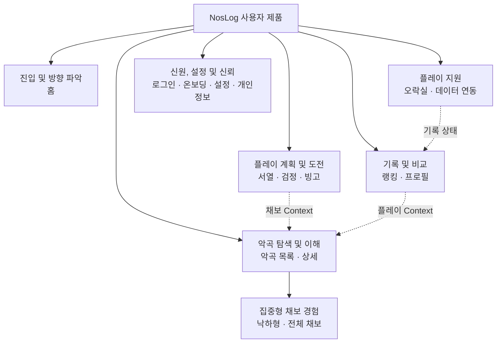

# NosLog 2.0 사용자 정보 구조 및 내비게이션

## 문서 관리

- 상태: `논의용 초안`
- 근거 상태: `현재 제품 감사, 저장소 확인, 브라우저 근거 및 인용한 내비게이션 가이드`
- 작성 시작일: 2026-07-29
- 문서 언어: 한국어 동기화본
- 영어 원본: [02-information-architecture.md](./02-information-architecture.md)
- 입력 감사 문서:
  [01-current-product-audit.ko.md](./01-current-product-audit.ko.md)
- 범위: NosLog 2.0 사용자 페이지 패밀리, 정보 구조, 내비게이션 및 중요한
  페이지 간 흐름
- 제외 범위: 관리자 인터페이스 재설계, 페이지 단위 시각 구성, 컴포넌트 스타일
  및 최종 경로 마이그레이션

## 결정 상태 표기

- **확정:** 사용자와 명시적으로 합의했으며 후속 요구사항으로 사용할 수 있습니다.
- **관찰:** 현재 제품, 저장소 또는 브라우저에서 확인했습니다.
- **제안:** 논의를 위한 추천이며 구현 승인을 받지 않았습니다.
- **미확정:** 조사, 테스트 또는 사용자 결정이 필요합니다.

이 문서에 내비게이션 또는 그룹 제안이 작성되어 있다는 이유만으로 승인된 것으로
간주하지 않습니다.

## 목적

이 문서는 페이지 기획서나 시각 디자인을 시작하기 전에 v1.6.0 기능 인벤토리를
사용자 중심 구조로 변환합니다. 다음 조건을 충족해야 합니다.

1. 유지하는 모든 사용자 기능에 명확한 위치를 부여합니다.
2. 페이지 패밀리와 전역 내비게이션 목적지를 구분합니다.
3. 보조 기능을 삭제하지 않으면서 가장 중요한 과업을 우선합니다.
4. 사용자가 관련 페이지 사이를 이동하는 방법을 정의합니다.
5. Figma 또는 구현 전에 미해결 내비게이션 결정을 드러냅니다.

## 확정된 입력

- **확정:** 홈은 가장 중요한 첫 진입 경험입니다. 사용자가 어디로 이동할지
  파악하고 중요한 정보를 즉시 얻을 수 있어야 합니다.
- **확정:** 악곡 탐색과 악곡 상세는 자주 사용하는 핵심 흐름입니다.
- **확정:** 서열표는 핵심 플레이 계획 흐름입니다.
- **확정:** 현재 제거하거나 보류하기로 예정된 사용자 기능은 없습니다.
- **확정:** 보조 기능을 다시 묶거나 점진적으로 공개할 수 있지만 기능과 발견
  가능성을 보존해야 합니다.
- **확정:** 관리자 인터페이스 재설계는 NosLog 2.0 사용자 화면 범위 밖이며
  2.0 이후에 진행할 수 있습니다.
- **확정:** 한국어, 일본어 및 영어 사용자 경로는 언어 Prefix URL을 유지합니다.
- **확정:** 모바일이 주요 사용 환경이지만 데스크톱도 필수 반응형 대상입니다.
- **관찰:** 채보 뷰어는 일반 콘텐츠 페이지와 다른 너비 및 컨트롤 모델이
  필요합니다.

## 참고 근거

| 출처                                                                                                                  | 가져올 원칙                                                                                      | NosLog 적용                                                                                                                    | 한계                                                                              |
| --------------------------------------------------------------------------------------------------------------------- | ------------------------------------------------------------------------------------------------ | ------------------------------------------------------------------------------------------------------------------------------ | --------------------------------------------------------------------------------- |
| [W3C WCAG 2.2: Multiple Ways](https://www.w3.org/WAI/WCAG22/Understanding/multiple-ways)                              | 사용자는 페이지 집합 안의 콘텐츠를 두 가지 이상의 방법으로 찾을 수 있어야 합니다.                | 중요한 악곡, 서열, 프로필 및 도전 목적지는 전역 내비게이션과 문맥 링크, 검색 또는 홈 허브를 통해 접근할 수 있어야 합니다.      | 특정 내비게이션 컴포넌트를 지정하지 않습니다.                                     |
| [W3C WCAG 2.2: Consistent Navigation](https://www.w3.org/WAI/WCAG22/Understanding/consistent-navigation.html)         | 반복되는 내비게이션은 동일한 상대적 순서를 유지해야 합니다.                                      | 모바일과 데스크톱의 레이아웃이 달라도 목적지 의미와 상대적 순서는 예측 가능해야 합니다.                                        | 문서화하고 검증한 집중형 Context에서는 의도적으로 축소된 셸을 사용할 수 있습니다. |
| [W3C WCAG 2.2: Consistent Identification](https://www.w3.org/WAI/WCAG22/Understanding/consistent-identification.html) | 반복되는 기능은 일관된 라벨과 식별을 사용해야 합니다.                                            | 검색, 연동, 프로필, 채보 뷰어 및 내비게이션 라벨은 ko, ja, en에서 의미적으로 일관돼야 합니다.                                  | 번역 길이에 따라 시각적 공간은 달라질 수 있지만 의미를 바꾸면 안 됩니다.          |
| [W3C WCAG 2.2: Bypass Blocks](https://www.w3.org/WAI/WCAG22/Understanding/bypass-blocks)                              | 순차 탐색 사용자는 반복되는 내비게이션을 건너뛸 수 있어야 합니다.                                | 내비게이션이 풍부해져도 건너뛰기 링크와 의미 있는 Landmark를 유지합니다.                                                       | 접근성 요구사항이며 시각적 레이아웃 추천은 아닙니다.                              |
| [GOV.UK: Navigate a service](https://design-system.service.gov.uk/patterns/navigate-a-service/)                       | 내비게이션은 가장 유용한 최상위 섹션으로 연결해야 하며 사이트맵이 되어서는 안 됩니다.            | NosLog 전역 내비게이션에는 자주 사용하는 목적지만 간결하게 노출하고, 유지하는 모든 기능에 같은 전역 비중을 줄 필요는 없습니다. | 공공 서비스 Context이므로 시각 패턴은 NosLog 아트 디렉션 레퍼런스가 아닙니다.     |
| [Figma: UI design principles](https://www.figma.com/resource-library/ui-design-principles/)                           | 계층과 점진적 공개는 사용자의 필요에 맞춰 가시적 우선순위를 정해야 합니다.                       | 홈 모듈과 보조 유틸리티를 같은 비중으로 배치하지 않고 과업 중요도에 따라 정렬합니다.                                           | 원칙을 제공할 뿐 NosLog에 특화된 근거는 아닙니다.                                 |
| [Material Design: Understanding navigation](https://m2.material.io/design/navigation/understanding-navigation.html)   | 소수의 모바일 최상위 목적지는 직접 접근을 유지하고 깊은 목적지는 다른 계층을 사용할 수 있습니다. | 4~5개 모바일 목적지 모델을 의무가 아닌 테스트 후보로 사용합니다.                                                               | 오래된 앱 내비게이션 레퍼런스이며 NosLog 스타일로 복제해서는 안 됩니다.           |

## 현재 내비게이션 모델

### 관찰된 전역 Surface

| Surface              | 현재 목적지 또는 역할                                                   | 현재 우선순위 신호                                                                              |
| -------------------- | ----------------------------------------------------------------------- | ----------------------------------------------------------------------------------------------- |
| 브랜드 링크          | 홈                                                                      | NosLog Wordmark를 통해 홈으로 갈 수 있지만 주요 내비게이션 항목으로 이름이 표시되지는 않습니다. |
| 주요 헤더 내비게이션 | 악곡, 랭킹, 서열                                                        | 세 목적지는 항상 직접 접근할 수 있습니다.                                                       |
| 보조 메뉴            | 빙고, 검정, 오락실, 데이터 연동 및 권한이 있을 때 관리자 진입           | 메뉴를 열어야 접근할 수 있습니다.                                                               |
| 사용자 컨트롤        | 로그인 상태에서는 아바타를 통한 공개 프로필, 비로그인 상태에서는 로그인 | 신원 및 계정 접근은 콘텐츠 내비게이션과 시각적으로 분리됩니다.                                  |
| 홈 검색              | 검색어를 악곡 페이지로 전달하는 악곡 탐색                               | 현재 가장 빠른 악곡 진입 경로입니다.                                                            |
| 홈 바로가기 Grid     | 악곡, 랭킹, 빙고, 서열, 검정, 오락실                                    | 여섯 기능이 거의 동일한 시각적 비중을 가집니다.                                                 |
| 홈 유틸리티 행       | 데이터 연동                                                             | 바로가기 Grid와 분리되어 있지만 항상 표시됩니다.                                                |
| 홈 하단 콘텐츠       | 피드백과 NOSTALGIA 공식 소식                                            | 제품 바로가기 다음에 보조 콘텐츠가 이어집니다.                                                  |
| 푸터                 | 개인정보처리방침과 GitHub                                               | 신뢰 및 외부 프로젝트 정보입니다.                                                               |

### 관찰된 구조적 증상

- 홈의 여섯 바로가기 타일은 비슷한 비중이므로 악곡, 서열 및 보조 기능 사이의
  확정된 우선순위 차이를 아직 표현하지 못합니다.
- 홈은 중요하지만 전역에서는 이름이 있는 목적지가 아니라 Wordmark로
  표현됩니다.
- 랭킹은 현재 주요 목적지이지만 홈, 프로필·기록 및 확정된 악곡·서열 과업과
  비교한 미래 우선순위는 아직 정하지 않았습니다.
- 데이터 연동, 피드백 및 공식 소식은 유용하지만 항상 독립적인 홈 블록으로
  표시되면 핵심 첫 진입 과업과 경쟁합니다.
- 현재 보조 메뉴는 빙고, 검정, 오락실 및 데이터 연동이 사용자 목표와 어떤
  관계인지 설명하지 않는 평면 목록입니다.
- 악곡 상세, 서열 항목, 검정 스테이지, 프로필 기록 및 랭킹 항목은 이미
  악곡으로 향하는 문맥 경로를 만듭니다. 이 관계를 전역 내비게이션만으로
  대체해서는 안 됩니다.

## 제안하는 사용자 페이지 패밀리

페이지 패밀리는 관련된 사용자 목표와 화면 Template을 묶습니다. 자동으로 전역
내비게이션 라벨이 되는 것은 아닙니다.

| 페이지 패밀리       | 사용자의 질문 또는 목표                                        | 포함 경로와 기능                                                                                   | 제안 관계                                                    |
| ------------------- | -------------------------------------------------------------- | -------------------------------------------------------------------------------------------------- | ------------------------------------------------------------ |
| 진입 및 방향 파악   | “지금 무엇을 할 수 있고, 무엇을 확인해야 하는가?”              | 홈, 공지, 전역 악곡 검색, 문맥 상태, 우선 바로가기, 공식 소식, 피드백 진입                         | 주요 진입 및 방향 파악 허브                                  |
| 악곡 탐색 및 이해   | “어떤 악곡을 찾고 있으며, 이 채보와 기록은 무엇을 의미하는가?” | 악곡 검색·목록, 악곡 상세, 난이도 전환, 채보 정보, 개인 기록, 채보 랭킹, 평가, 공개 채보 뷰어      | 핵심 제품 패밀리                                             |
| 플레이 계획 및 도전 | “다음에 무엇을 플레이하고 어떤 목표를 추구할 것인가?”          | 서열표, 검정, 빙고 목록·상세, 목표 필터, 시뮬레이션, 미션, 증빙 제출                               | 서열표는 직접 중요성을 유지하고 검정·빙고는 관련 도전 Branch |
| 기록 및 비교        | “내가 얼마나 성장했고 다른 사용자와 비교하면 어떤가?”          | 전체 랭킹, 공개 프로필, Grd·Rating 추이, 베스트·최근 플레이, 판정 분석, 공개 프로필 링크           | 악곡과 플레이 계획을 가로지르는 패밀리                       |
| 플레이 지원         | “어디서 플레이하고 기록을 어떻게 NosLog로 가져오는가?”         | 오락실 탐색, 선호 오락실, 데이터 연동 안내, 토큰 및 연동 상태                                      | 보조적이지만 필수적인 운영 지원                              |
| 신원, 설정 및 신뢰  | “서비스에 어떻게 진입하고 설정하며 신뢰할 수 있는가?”          | 로그인, 온보딩, 프로필 설정, 언어, 번역 제목 설정, 개인정보, 탈퇴, 점검, 오류 및 찾을 수 없음 상태 | 유틸리티 및 Lifecycle 패밀리                                 |
| 집중형 채보 경험    | “이 채보는 시간에 따라 어떻게 연주되는가?”                     | 낙하형, 전체 채보, 로컬 음원, 재생 컨트롤, 메트로놈, 엄밀한 연주                                   | 전역 목적지가 아닌 악곡 상세의 특수한 하위 Context           |

### 패밀리 규칙

- 여러 패밀리로 향하는 문맥 링크가 있더라도 현재 사용자 경로는 하나의 주
  패밀리에 속해야 합니다.
- 한 페이지 패밀리에 여러 Template과 상태가 포함될 수 있으며 모든 페이지가
  하나의 레이아웃을 공유한다는 뜻은 아닙니다.
- 악곡 상세는 하나의 채보에 대한 핵심 교차 링크 허브입니다.
- 데이터가 채보를 식별할 수 있다면 서열, 검정, 프로필 및 랭킹 항목에서 해당
  악곡 상세로 직접 이동할 수 있어야 합니다.
- 채보 뷰어는 악곡의 하위 Context로 유지하며, 방향 정보와 신뢰할 수 있는 복귀
  경로를 보존하면서 일반 전역 내비게이션을 줄인 집중형 셸을 사용할 수 있습니다.
- 이전 서열 URL은 호환성 Redirect로 유지하며 내비게이션 목적지로 노출하지
  않습니다.

## 제안 구조 Map

아래 Map은 페이지 패밀리 관계를 나타내며 최종 전역 내비게이션 컴포넌트가
아닙니다.

## 제안 계층

### Level 0: 서비스 셸

반복되는 셸은 다음을 제공해야 합니다.

- NosLog 정체성과 신뢰할 수 있는 홈 이동 경로
- 간결한 최상위 목적지
- 로그인 프로필 또는 비로그인 로그인 진입
- 보조 목적지 및 전역 설정 접근
- 메인 콘텐츠로 건너뛰는 경로
- 다국어 페이지 전체에서 안정적인 내비게이션 이름과 순서

### Level 1: 직접 목적지 후보

다음 목적지 순서는 **테스트 제안**이며 승인되지 않았습니다.

1. 홈
2. 악곡
3. 서열
4. 랭킹
5. 더보기

근거는 다음과 같습니다.

- 홈, 악곡 및 서열은 확정된 우선순위를 직접 반영합니다.
- 랭킹은 현재의 주요 제품 기능과 NosLog의 기록·랭킹 중심성을 유지하지만 실제
  사용과 비교한 확인이 더 필요합니다.
- 더보기는 유지하는 모든 기능을 전역에 같은 비중으로 늘어놓지 않으면서 도전,
  플레이 지원, 설정 및 신뢰 콘텐츠로 이동하는 경로를 보존합니다.
- 프로필은 인증 상태에 따라 목적지를 바꾸지 않고 안정적인 신원 컨트롤로
  유지합니다.

### Level 2: 보조 그룹 후보

| 그룹         | 포함 후보                             | 참고                                                                                         |
| ------------ | ------------------------------------- | -------------------------------------------------------------------------------------------- |
| 도전         | 검정, 빙고                            | 두 기능 모두 구조화된 목표이지만 최종 한글·일본어·영어 그룹 라벨은 언어 테스트가 필요합니다. |
| 플레이 지원  | 오락실, 데이터 연동                   | 콘텐츠 탐색보다 아케이드 플레이와 기록 수집을 지원합니다.                                    |
| 계정 및 설정 | 프로필, 설정, 언어, 번역 제목 설정    | 로그인 상태에서 아바타를 통해 프로필에 직접 접근합니다.                                      |
| 도움 및 신뢰 | 피드백, 개인정보, 서비스 상태, GitHub | 피드백 위치는 일관돼야 하며 개인정보는 직접 찾을 수 있어야 합니다.                           |

직접 문맥 링크가 더 명확하다면 이 그룹 때문에 불필요한 중간 페이지를
추가해서는 안 됩니다.

## 홈 정보 구조

### 확정 역할

홈은 모든 페이지를 작게 복사한 Dashboard가 아니라 방향 파악 및 이동
Surface입니다.

### 제안하는 우선순위 계층

1. **서비스 핵심 공지:** 공지 또는 서비스 상태가 실제 이용에 영향을 줄 때만
   표시합니다.
2. **주요 악곡 검색:** 악곡 검색은 자주 사용하는 과업이므로 즉시 사용할 수
   있게 유지합니다.
3. **문맥상 다음 행동:** 로그인 상태에서는 실행 가능한 기록·연동·플레이
   이어하기를 표시할 수 있고, 비로그인 상태에서는 공개 탐색을 막지 않으면서
   로그인 가치를 설명할 수 있습니다.
4. **주요 목적지:** 악곡과 서열은 보조 기능보다 강한 계층을 가집니다.
5. **기록 및 도전:** 랭킹, 검정 및 빙고를 다음 계층에서 찾을 수 있습니다.
6. **플레이 지원:** 오락실과 데이터 연동은 문맥에 따라 또는 지원 섹션에
   표시합니다.
7. **편집 및 지원 콘텐츠:** 공식 소식과 피드백은 핵심 제품 과업 다음에
   유지합니다.

### 합의한 점진적 공개 후보

- **데이터 연동:** 제거하지 않습니다. 한 번도 연동하지 않았거나, 연동이
  오래됐거나, 오류가 있을 때 눈에 띄는 문맥 상태를 고려합니다. 그 외에는
  플레이 지원·프로필의 안정적인 경로를 유지하면서 홈의 상시 비중을 줄입니다.
- **피드백:** 제거하지 않습니다. 주요 제품 과업과 같은 계층을 부여하기보다
  일관된 지원 위치를 고려합니다.
- **공식 소식:** 제거하지 않습니다. 조사 결과 더 강한 역할이 필요하지 않다면
  과업 중심 홈 계층 다음의 편집 콘텐츠로 유지합니다.

정확한 모듈, 콘텐츠, 개인화 및 순서는 홈 페이지 기획서 승인 전까지
미확정입니다.

## 주요 사용자 흐름

| 흐름                    | 진입                                          | 필수 순서                                                   | 성공 조건                                                                        | 중요한 복구 또는 Branch                                        |
| ----------------------- | --------------------------------------------- | ----------------------------------------------------------- | -------------------------------------------------------------------------------- | -------------------------------------------------------------- |
| 채보 빠르게 찾기        | 홈 검색 또는 전역 악곡                        | 검색·필터 → 결과 → 악곡 상세 → 난이도·탭                    | 사용자가 올바른 악곡·채보 정보에 도달하고 원문 및 선택한 번역 제목을 이해합니다. | 결과 없음, 모호한 제목, 없는 난이도, 비로그인 개인 기록 안내   |
| 서열에 따라 플레이 선택 | 홈 또는 전역 서열                             | 모드·목표 선택 → 구간 확인 → 채보 선택 → 악곡 상세          | 사용자가 적절한 다음 채보를 찾고 자신의 기록을 확인할 수 있습니다.               | 공개 목록 없음, 개인 기록 없음, 필터 빈 상태                   |
| 성장 확인               | 프로필 아바타 또는 랭킹                       | 프로필·랭킹 → 요약 또는 항목 → 악곡 상세                    | 사용자가 현재 순위나 기록을 이해하고 근거 플레이를 확인할 수 있습니다.           | 비공개 항목, 비로그인, 플레이 없음, 랭킹 요청 오류             |
| 구조화된 도전 수행      | 더보기·홈 문맥 → 검정 또는 빙고               | 도전 선택 → 요구조건 확인 → 채보·미션 → 갱신 또는 제출      | 사용자가 다음 요구조건과 현재 완료 상태를 이해합니다.                            | 로그인 필요, 이용 불가 이벤트, 불완전한 증빙, 검증·업로드 오류 |
| 연동 설정 또는 복구     | 홈·프로필 문맥 상태 또는 더보기 → 데이터 연동 | 상태 이해 → 북마클릿 설치·실행 → 결과 확인 → 프로필         | 사용자가 기록 최신 여부와 변경 내용을 이해합니다.                                | 토큰 재발급, 처리 중, 오래됨, 일부 반영, 실패, 이력 없음       |
| 채보 재생 확인          | 악곡 상세 → 채보 뷰어                         | 집중형 뷰어 진입 → 낙하형·전체 채보 선택 → 설정·재생 → 복귀 | 사용자가 Context를 잃지 않고 채보 타이밍과 손·경로 동작을 이해합니다.            | 비공개 채보, 로컬 음원 없음, 좁은 뷰포트, 재생 오류            |

## 교차 링크 요구사항

- 악곡은 전역 내비게이션, 홈 검색 및 데이터가 허용하는 서열·검정·프로필
  플레이·랭킹의 문맥 채보 링크를 통해 접근할 수 있어야 합니다.
- 서열은 전역 내비게이션, 홈 계층 및 관련 악곡 상세 Context를 통해 접근할 수
  있어야 합니다.
- 프로필은 로그인 신원 컨트롤과 공개 사용자 링크에서 접근할 수 있어야 합니다.
- 데이터 연동은 안정적인 보조 위치와 행동이 필요한 문맥 상태 안내에서 접근할
  수 있어야 합니다.
- 개인정보처리방침은 비로그인 상태와 계정 파괴 결정에서 접근할 수 있어야 합니다.
- 유지되는 어떤 페이지도 기억한 URL에 의존하는 고립 페이지가 되어서는 안 됩니다.

## 결정을 위한 반응형 내비게이션 모델

### Option A: 모바일 고정 하단 내비게이션

일반 사용자 페이지에서 홈, 악곡, 서열, 랭킹 및 더보기로 구성된 하단 Bar를
사용합니다.

**장점**

- 확정된 핵심 과업이 항상 보이고 한 손으로 접근하기 쉽습니다.
- 홈이 명시적인 목적지가 됩니다.
- 페이지 전체에서 목적지 순서를 안정적으로 유지할 수 있습니다.

**위험**

- 모바일 브라우저 Chrome, Safe Area, 긴 페이지 콘텐츠 및 뷰어 재생 컨트롤과
  공간을 경쟁합니다.
- Focus 순서, 활성 상태 의미, 번역 라벨 및 스크롤 Padding을 세심하게
  처리해야 합니다.
- 보조 목적지는 여전히 더보기 안에 있습니다.

### Option B: 간결한 상단 헤더

상단 헤더에 홈·브랜드, 악곡, 서열, 선택한 추가 목적지 및 메뉴·프로필 컨트롤을
노출합니다.

**장점**

- 콘텐츠와 재생 컨트롤을 위해 화면 아래쪽을 보존합니다.
- 셸 복잡성을 덜 늘리면서 현재 상호작용 모델을 발전시킵니다.
- 데스크톱 너비에서 자연스럽게 확장할 수 있습니다.

**위험**

- 자주 사용하는 목적지를 한 손으로 누르기 어렵습니다.
- 스크롤에서 헤더가 숨으면 모든 내비게이션이 일시적으로 사라질 수 있습니다.
- 좁은 너비에서는 번역 라벨과 신원 컨트롤 공간이 부족합니다.

### Option C: 일반 페이지 내비게이션과 집중형 뷰어 셸

일반 페이지에는 안정적인 내비게이션 모델을 사용하지만 채보 뷰어에는 뒤로가기,
채보 정체성 및 필수 뷰어 컨트롤을 가진 문서화된 집중형 셸을 사용합니다.

**장점**

- 채보 재생이 다른 상호작용 Context임을 인정합니다.
- 전역 내비게이션이 피아노, Canvas, Seek Bar 및 재생 컨트롤과 경쟁하지
  않습니다.
- 일반 페이지에서 Option A 또는 B와 결합할 수 있습니다.

**위험**

- 명확한 복귀 경로와 상태 보존이 필요합니다.
- 뷰어가 다른 서비스처럼 느껴지면 안 됩니다.
- 접근성 테스트에서 Landmark, 진입·복귀 Focus 및 방향 파악을 확인해야 합니다.

### 초기 추천

**제안:** 일반 모바일 페이지에는 Option A를, 채보 뷰어에는 Option C를 함께
테스트합니다. 데스크톱에서는 같은 목적지 의미와 상대적 순서를 유지하면서
확장된 상단 내비게이션을 테스트합니다.

이 추천은 사용자 승인과 대표 Prototype 검증이 필요하며 구현을 승인하지
않습니다.

## 데스크톱 확장 원칙

- 현재 중앙 390px 셸을 일반 데스크톱 구조로 유지하지 않습니다.
- 모바일과 동일한 정보 계층과 목적지 이름을 보존합니다.
- 추가 너비는 카드와 빈 여백만 키우지 않고 비교, 필터, 기록 분석 및 관련
  Context에 사용합니다.
- 보조 Panel을 도입해도 명확한 주요 콘텐츠 열을 유지합니다.
- 데스크톱 전용 기능 분류 체계를 따로 만들지 않습니다.
- 집중형 채보 뷰어는 일반 읽기 페이지보다 훨씬 넓은 공간을 사용할 수 있습니다.

## 다국어 및 접근성 요구사항

- 모든 전역 및 보조 내비게이션 라벨을 한국어, 일본어 및 영어에서 검증합니다.
- 번역을 짧게 만들기 위해 목적지 의미를 바꾸지 않습니다.
- 각 언어 페이지에서 반복되는 내비게이션은 동일한 상대적 순서를 유지합니다.
- 현재 페이지 상태는 의미 있는 `aria-current` 또는 적합한 동등 수단을 사용합니다.
- 메뉴는 이름, 역할, 확장 상태, 제어 대상, Escape 동작 및 예측 가능한 Focus
  복귀를 제공합니다.
- 일반 페이지에는 건너뛰기 링크와 하나의 페이지 단위 `main` Landmark가
  필요합니다.
- 채보 뷰어에서 현재 관찰된 중첩 `main` Landmark를 제거해야 합니다.
- 상호작용 Target은 WCAG 2.2 최소 크기 또는 간격 요구사항을 충족해야 하며,
  자주 사용하는 모바일 목적지는 최소보다 큰 크기를 목표로 합니다.
- 넓은 너비의 시각적 재배치가 비논리적인 읽기 또는 Focus 순서를 만들면 안 됩니다.

## URL 및 라우팅 입장

- **확정:** `/ko`, `/ja`, `/en` 언어 Prefix를 유지합니다.
- **제안:** 경로가 합의한 계층을 막거나 명확한 사용성 문제를 만들지 않는 한
  첫 디자인 마일스톤에서는 현재 사용자 경로 Slug를 유지합니다.
- **제안:** `/tiers/[slug]`를 노출된 IA Node가 아니라 호환성 동작으로
  취급합니다.
- **미확정:** 미래 그룹에 실제 Landing Page가 필요한지 내비게이션 메뉴
  그룹만 필요한지 결정합니다.
- 경로 변경은 승인 전에 Redirect, Canonical, 공유 링크, 다국어 및 분석 영향을
  포함해야 합니다.

## 결정 기록

| ID    | 결정                             | 추천                                                               | 상태     |
| ----- | -------------------------------- | ------------------------------------------------------------------ | -------- |
| IA-01 | 일반 모바일 전역 내비게이션 모델 | 홈, 악곡, 서열, 랭킹, 더보기 하단 내비게이션 테스트                | `미확정` |
| IA-02 | 채보 뷰어 셸                     | 신뢰할 수 있는 복귀 경로가 있는 집중형 셸 사용                     | `미확정` |
| IA-03 | 랭킹 전역 우선순위               | 첫 Prototype에서는 직접 목적지로 유지한 뒤 검증                    | `미확정` |
| IA-04 | 로그인 홈 개인화                 | Dashboard 복제가 아닌 작은 실행 가능한 다음 상태 모듈만 표시       | `미확정` |
| IA-05 | 데이터 연동 위치                 | 행동이 필요할 때 문맥상 강조하고 그 외에는 안정적인 보조 경로 제공 | `제안`   |
| IA-06 | 피드백 위치                      | 주요 과업 계층 밖의 안정적인 지원 위치                             | `제안`   |
| IA-07 | 공식 소식 위치                   | 핵심 제품 과업 다음의 편집 콘텐츠                                  | `제안`   |
| IA-08 | 보조 그룹 라벨                   | 세 언어에서 도전, 플레이 지원, 계정 및 신뢰 그룹 라벨 테스트       | `미확정` |
| IA-09 | 일반 데스크톱 내비게이션         | 의미 순서를 바꾸지 않고 일반 페이지 내비게이션 확장                | `미확정` |

## 사용자 검토 질문

1. 첫 모바일 Prototype에서 **홈, 악곡, 서열, 랭킹, 더보기** 고정 하단
   내비게이션을 테스트할까요, 아니면 일반 페이지에서 상단 전용 내비게이션을
   유지할까요?
2. 명확한 복귀 경로와 현재 악곡·채보 정보를 보존한다면, 채보 뷰어에서는 일반
   전역 내비게이션을 숨긴 집중형 셸을 사용할까요?
3. 로그인 홈에서 오래된 연동, 최근 플레이 또는 미완료 도전 같은 하나의
   문맥상 다음 행동을 표시할까요, 아니면 계정 컨트롤을 제외하고 로그인·비로그인
   홈을 동일하게 유지할까요?
4. 서열은 직접 접근을 유지하면서 빙고와 검정을 ‘도전’ 개념으로 묶어도 될까요?
5. 홈, 악곡 및 서열의 우선순위가 가장 높다고 확정했더라도 첫 Prototype에서
   랭킹을 전역 직접 목적지로 유지할까요?

## 이 문서의 승인 기준

- 유지하는 모든 사용자 경로가 하나의 주 페이지 패밀리에 배정됩니다.
- 검증된 기능이 페이지 패밀리 Map 또는 교차 링크 요구사항에서 사라지지 않습니다.
- 홈, 악곡 및 서열을 명시적인 최우선 요소로 다룹니다.
- 관리자 재설계를 사용자 내비게이션 모델과 섞지 않습니다.
- 제안과 확정 결정을 눈에 띄게 구분합니다.
- 주요 흐름에 성공 및 복구 Branch를 포함합니다.
- 내비게이션 컴포넌트가 달라도 모바일과 데스크톱은 같은 의미적 계층을
  사용합니다.
- 라벨을 확정하기 전에 한국어, 일본어 및 영어 제약을 포함합니다.
- 페이지 기획서를 시작하기 전에 사용자가 미확정 결정 기록을 승인합니다.

## 다음 작업

1. 사용자와 IA-01부터 IA-09까지 검토하고 해결합니다.
2. 결정에 따라 페이지 패밀리 Map과 흐름을 수정합니다.
3. 중요한 정보 구조 불확실성이 없어지면 이 문서를 승인 상태로 변경합니다.
4. 홈, 악곡 탐색, 악곡 상세, 서열, 나머지 페이지 패밀리 순서로 페이지
   기획서를 작성합니다.
