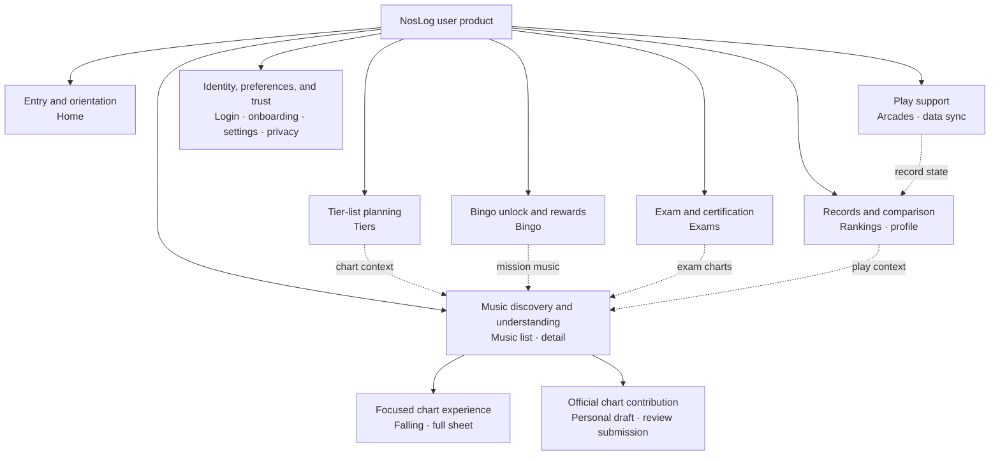

# NosLog 2.0 User Information Architecture and Navigation

## Document Control

- Status: `Approved`
- Evidence status: `Current-product audit, repository inspection, browser evidence, and cited navigation guidance`
- Date started: 2026-07-29
- Date approved: 2026-07-30
- Last decision update: 2026-08-08 (`IA-21` / Home `HOME-18`)
- Canonical language: English
- Korean companion:
  [02-information-architecture.ko.md](./02-information-architecture.ko.md)
- Input audit: [01-current-product-audit.md](./01-current-product-audit.md)
- Approved shared-shell contract:
  [15-shared-shell-navigation-brief.md](./15-shared-shell-navigation-brief.md)
- Approved authentication and onboarding contract:
  [17-authentication-onboarding-page-brief.md](./17-authentication-onboarding-page-brief.md)
- Approved privacy and data-practices contract:
  [18-privacy-data-practices-page-brief.md](./18-privacy-data-practices-page-brief.md)
- Approved system-recovery states contract:
  [19-system-recovery-states-page-brief.md](./19-system-recovery-states-page-brief.md)
- Approved chart-contribution editor contract:
  [20-chart-editor-contribution-page-brief.md](./20-chart-editor-contribution-page-brief.md)
- Scope: User-facing NosLog 2.0 page families, information architecture,
  navigation, and important cross-page flows
- Excluded: Administrator-interface redesign, page-level visual composition,
  component styling, and final route migration

## Decision Labels

- **Confirmed:** Explicitly agreed with the user and usable as a downstream
  requirement.
- **Observed:** Verified from the current product, repository, or browser.
- **Proposed:** Recommended for discussion; not approved for implementation.
- **Open:** Requires research, testing, or a user decision.
- **Superseded:** Replaced by a later approved decision and retained for history.

No proposed navigation or grouping in this document is approved merely because it is
written here.

## Purpose

This document turns the v1.6.0 feature inventory into a user-centered structure before
page briefs or visual design begin. It must:

1. give every retained user-facing function a clear home;
2. distinguish page families from global-navigation destinations;
3. prioritize the most important tasks without deleting secondary functions;
4. define how users move between related pages;
5. expose unresolved navigation decisions before Figma or implementation work.

## Confirmed Inputs

- **Confirmed:** Home is the most important first-entry experience. It must help users
  understand where to go and obtain important information immediately.
- **Confirmed:** Music discovery and music detail form a primary, high-frequency
  journey.
- **Confirmed:** Tier lists are a primary play-planning journey.
- **Confirmed:** No existing user-facing function is currently scheduled for removal
  or deferral.
- **Confirmed:** Secondary functions may be regrouped or progressively disclosed, but
  their capability and discoverability must be preserved.
- **Confirmed:** Administrator-interface redesign is outside the NosLog 2.0
  user-facing scope and may be addressed after 2.0.
- **Confirmed:** Korean, Japanese, and English user routes retain locale-prefixed URLs.
- **Confirmed:** Mobile is the primary use context, while desktop remains a required
  responsive target.
- **Confirmed:** Ordinary pages use a responsive top header, not a persistent bottom
  navigation. The header contains the NosLog identity on the left and only the
  profile/account control plus the More control on the right.
- **Confirmed:** The More control opens distinct navigation blocks. Tier lists, bingo,
  and exams must remain separate NOSTALGIA contents and must not be placed under a
  combined label or landing page.
- **Confirmed:** Signed-out users see a visible Login text button in the header's
  account position.
- **Confirmed:** Home retains a grid-like set of direct navigation blocks so users can
  quickly move to each service function.
- **Confirmed:** Chart Viewer remains a directly discoverable home and More-panel
  destination, but it opens the shared music-search surface in chart-search scope
  rather than creating a duplicate search page.
- **Confirmed:** Music search and public-chart search share one search surface. A
  compact leading scope selector inside the search field switches between them.
- **Confirmed:** Avoid persistent rows of mode and filter buttons when a compact,
  understandable contextual selector or progressive disclosure can preserve the same
  capability and discoverability.
- **Confirmed:** Home does not add a signed-in personalization card for stale sync,
  recent plays, or unfinished content.
- **Confirmed:** Feedback and error reporting move out of Home and remain available
  from a consistent support area in the More panel. The current dialog-based
  submission flow is retained; focused-chart-viewer access is a later viewer-brief
  decision.
- **Confirmed:** Routine NosLog announcements and official NOSTALGIA news remain
  lower-priority editorial content on Home after the core search, navigation, and Data
  Sync tasks. Home shows the newest three routine announcements as title-and-date
  links before one latest official X post.
- **Confirmed:** Privacy and GitHub remain footer destinations and are not duplicated
  in the More panel.
- **Confirmed:** Settings becomes one public destination for signed-out and signed-in
  users. Signed-out users can configure device-level experience preferences, while
  authenticated users see additional profile and account settings.
- **Observed:** The chart viewer needs a different width and control model from normal
  content pages.
- **Confirmed:** The chart viewer uses a focused shell, and the falling/curved-path
  viewer includes a fullscreen entry and exit.

## Reference Basis

| Source                                                                                                                | Transferable principle                                                                                                                     | NosLog application                                                                                                                                             | Limitation                                                                                         |
| --------------------------------------------------------------------------------------------------------------------- | ------------------------------------------------------------------------------------------------------------------------------------------ | -------------------------------------------------------------------------------------------------------------------------------------------------------------- | -------------------------------------------------------------------------------------------------- |
| [W3C WCAG 2.2: Multiple Ways](https://www.w3.org/WAI/WCAG22/Understanding/multiple-ways)                              | Users should have more than one way to locate content within a set of pages.                                                               | Important music, tier, ranking, bingo, exam, and profile destinations should be reachable through the home grid, the More panel, search, or contextual links.  | It does not prescribe a specific navigation component.                                             |
| [W3C WCAG 2.2: Consistent Navigation](https://www.w3.org/WAI/WCAG22/Understanding/consistent-navigation.html)         | Repeated navigation should remain in the same relative order.                                                                              | Mobile and desktop may use different layouts, but destination meaning and relative order should remain predictable.                                            | Different focused contexts may use a deliberately reduced shell when documented and tested.        |
| [W3C WCAG 2.2: Consistent Identification](https://www.w3.org/WAI/WCAG22/Understanding/consistent-identification.html) | Repeated functions should use consistent labels and identification.                                                                        | Search, sync, profile, chart-viewer, and navigation labels must remain semantically consistent across ko, ja, and en.                                          | Translation length may require different visual space without changing meaning.                    |
| [W3C WCAG 2.2: Bypass Blocks](https://www.w3.org/WAI/WCAG22/Understanding/bypass-blocks)                              | Repeated navigation must be bypassable for sequential navigation.                                                                          | Preserve a skip link and semantic landmarks even if the navigation becomes richer.                                                                             | This is an accessibility requirement, not a visual layout recommendation.                          |
| [GOV.UK: Navigate a service](https://design-system.service.gov.uk/patterns/navigate-a-service/)                       | Navigation should link to the most useful top-level sections and should not become a site map.                                             | The global NosLog navigation should expose a compact set of frequent destinations; all retained features do not need equal global prominence.                  | GOV.UK is a public-service context, so its visual pattern is not a NosLog art-direction reference. |
| [GOV.UK: Service navigation](https://design-system.service.gov.uk/components/service-navigation/)                     | A service identity and navigation menu can remain in one top system, with multi-item navigation collapsing behind a menu at narrow widths. | Keep the NosLog identity and More control in a stable top header while allowing the navigation-block panel to adapt to available width.                        | The component's branding and exact visual treatment are not applicable to NosLog.                  |
| [USWDS: Header](https://designsystem.digital.gov/components/header/)                                                  | A header identifies the site and provides organized access to major sections; simple and expanded variants respond to available width.     | Use a restrained header shell and let the More panel carry navigation blocks instead of forcing labels into the narrow header.                                 | USWDS is an implementation reference, not a visual style source.                                   |
| [Carbon: Global header](https://carbondesignsystem.com/patterns/global-header/)                                       | A simple product can use a header-only shell, while the exact shell configuration should match information depth.                          | NosLog can preserve one semantic top-header model across mobile and desktop and adapt the opened panel rather than adding a mobile-only bottom model.          | Carbon targets enterprise products and should inform structure only.                               |
| [Carbon: Disclosures](https://carbondesignsystem.com/patterns/disclosures-pattern/)                                   | Profile and More menus should expose concise global navigation and settings without becoming overcrowded.                                  | Keep Settings and Feedback as compact utility entries after the product destinations; do not duplicate footer links or full setting controls inside the panel. | Carbon's enterprise examples do not determine NosLog's visual styling or exact labels.             |
| [Figma: UI design principles](https://www.figma.com/resource-library/ui-design-principles/)                           | Hierarchy and progressive disclosure should align visible priority with user need.                                                         | Home modules and secondary utilities should be ordered by task importance instead of rendered at equal weight.                                                 | The article provides principles rather than NosLog-specific evidence.                              |
| [W3C: Guiding users to translated pages](https://www.w3.org/International/questions/qa-site-conneg)                   | Automatic language negotiation should be supplemented by a manual control, and an explicit choice should be remembered.                    | Keep language selection available to signed-out users through public Settings and preserve the explicit browser-level choice.                                  | It addresses language selection, not the full settings information architecture.                   |
| [Google Search settings](https://www.google.com/preferences)                                                          | A public settings surface can expose language, theme, and browser-scoped experience preferences before sign-in.                            | NosLog's language and theme are valid signed-out settings rather than account-gated controls.                                                                  | Google Search has a broader preference set and different personalization model.                    |
| [YouTube: Change language or location settings](https://support.google.com/youtube/answer/87604)                      | A service can store an explicit signed-out language choice in the browser and apply it across the site.                                    | Use browser persistence for signed-out display preferences while reserving account-specific controls for authentication.                                       | YouTube exposes some preferences directly in its profile menu rather than one public page.         |
| [GNU: Select language](https://www.gnu.org/server/select-language.en.html)                                            | A guest choice can override browser defaults through a narrowly scoped cookie without requiring an account.                                | Treat automatic locale detection as an initial default, not as a replacement for public manual settings.                                                       | This is a single-purpose language control, not a full application settings model.                  |
| [GOV.UK: Footer](https://design-system.service.gov.uk/components/footer/)                                             | The footer is an appropriate persistent home for secondary service and policy links.                                                       | Keep Privacy in the footer instead of duplicating it in the task-oriented More panel.                                                                          | Exact government footer content and visual treatment do not transfer.                              |
| [USWDS: Footer](https://designsystem.digital.gov/components/footer/)                                                  | Footer content should support trust and secondary information without competing with primary navigation.                                   | Keep Privacy and the external GitHub project link in the footer and outside the core destination hierarchy.                                                    | USWDS does not prescribe whether every product should expose GitHub.                               |
| [Apple: Search fields](https://developer.apple.com/design/human-interface-guidelines/search-fields)                   | Clearly defined search categories may use a scope control, and the field or result area should communicate what can be searched.           | One music-search surface can switch between Music and Chart scope while changing the field cue and result behavior.                                            | Apple platform components are not copied as NosLog visual styling.                                 |
| [Baymard: Search scope](https://baymard.com/blog/search-scope)                                                        | A manual scope selector should be self-evident, secondary to the search field, and placed close to it.                                     | Place a compact leading selector inside the field instead of adding a permanent row of search-mode buttons.                                                    | The research is e-commerce-oriented; only the scope-clarity principle transfers.                   |
| [W3C APG: Accessible names](https://www.w3.org/WAI/ARIA/apg/practices/names-and-descriptions/)                        | Interactive controls require accessible names, and visible text is preferred when it can clarify purpose.                                  | The compact icon selector needs an accessible name, expanded state, and text labels in its opened menu; the field cue and results reinforce the active scope.  | An accessible name alone does not prove that an unfamiliar icon is visually understood.            |

## Current Navigation Model

### Observed Global Surfaces

| Surface                   | Current destinations or role                                           | Current priority signal                                                                      |
| ------------------------- | ---------------------------------------------------------------------- | -------------------------------------------------------------------------------------------- |
| Brand link                | Home                                                                   | Home is available through the NosLog wordmark but is not named as a primary navigation item. |
| Primary header navigation | Music, rankings, tiers                                                 | Three destinations receive persistent direct access.                                         |
| Secondary menu            | Bingo, exams, arcades, data sync; administrator entry when authorized  | These functions require opening the menu.                                                    |
| User control              | Public profile through the signed-in avatar, or login while signed out | Identity and account access are visually separate from content navigation.                   |
| Home search               | Music discovery with the query carried to the music page               | The fastest current music-entry path.                                                        |
| Home shortcut grid        | Music, rankings, bingo, tiers, exams, arcades                          | Six functions receive nearly equal visual weight.                                            |
| Home utility row          | Data sync                                                              | Sync is separated from the shortcut grid but is always present.                              |
| Home lower content        | Feedback and official NOSTALGIA news                                   | Supporting content follows product shortcuts.                                                |
| Footer                    | Privacy and GitHub                                                     | Trust and external project information.                                                      |

### Observed Structural Symptoms

- The six home shortcut tiles currently have similar visual weight. Their exact
  hierarchy remains a page-brief decision, but the grid itself remains an approved
  navigation mechanism.
- Home is globally available through the NosLog identity and does not require a second
  labeled header destination.
- Music, rankings, and tiers currently occupy the header. In NosLog 2.0 they move into
  the More navigation blocks and the home grid, leaving the header visually restrained.
- Feedback and official news compete with core first-entry tasks when promoted as
  independent primary Home blocks. Data Sync remains a required peer destination and
  More-panel entry under the later approved Home contract.
- The current secondary menu already keeps bingo, exams, arcades, and data sync as
  distinct links. The redesigned More panel must retain that separation while improving
  the responsive block layout.
- Music detail, tier entries, exam stages, profile records, and ranking entries already
  create contextual routes to music. These relationships are valuable and should not
  be replaced by global navigation alone.

## Approved User Page Families

Page families group related user goals and screen templates. They are not automatically
global-navigation labels.

| Page family                       | User question or goal                                                   | Included routes and functions                                                                                                                                 | Confirmed or proposed relationship                                    |
| --------------------------------- | ----------------------------------------------------------------------- | ------------------------------------------------------------------------------------------------------------------------------------------------------------- | --------------------------------------------------------------------- |
| Entry and orientation             | “Where can I go, and what information is immediately useful?”           | Home, routine-announcement summary, localized announcement archive and detail, global music search, direct navigation blocks, official news, feedback entry   | Primary entry and routing hub                                         |
| Music discovery and understanding | “Which music am I looking for, and what do its chart and records mean?” | Music search/list, music detail, difficulty switching, chart information, personal record, chart ranking, evaluation, published chart viewer                  | Primary product family                                                |
| Tier-list planning                | “Which chart should I play next for this goal?”                         | Tier lists, mode/goal selection, filters, tier bands, personal record context                                                                                 | Independent NOSTALGIA-related planning content                        |
| Bingo unlock and rewards          | “What bingo progress unlocks music or earns NOS?”                       | Bingo list/detail, 5×5 missions, line/cell progress, music unlock and NOS reward context                                                                      | Independent NOSTALGIA content; not a generic challenge branch         |
| Exam and certification            | “What is my assessed skill level and which title can I earn?”           | Exam selection, requirements, stages, allowed charts, simulation/advice, NOS use, title/reward and proof submission                                           | Independent NOSTALGIA skill-assessment content                        |
| Records and comparison            | “How am I progressing, and how do I compare?”                           | Global rankings, public profile, grade/rating trends, best and recent plays, judgement analytics, public profile links                                        | Cross-cuts music and separate NOSTALGIA content                       |
| Play support                      | “Where can I play, and how do I bring my records into NosLog?”          | Arcade discovery, preferred arcade, data-sync guide, token and sync state                                                                                     | Secondary but essential operational support                           |
| Identity, preferences, and trust  | “How do I enter, configure, and trust the service?”                     | Login, onboarding, public settings, authenticated profile/account settings, locale, theme, privacy, account deletion, maintenance, error and not-found states | Utility and lifecycle family                                          |
| Focused chart experience          | “How does this chart play over time?”                                   | Chart-scoped discovery entry, falling chart view, fullscreen falling view, full-sheet view, local audio, playback controls, metronome, strict performance     | Specialized child context of music with a direct discovery entry      |
| Official chart contribution       | “How can I help improve the official NosLog chart?”                     | Personal chart draft, local-audio authoring, preview, revision history, immutable review submission, change request, rejection, accepted contributor credit   | Signed-in contribution workflow; not a public alternate-chart catalog |

### Family Rules

- Every current user-facing route must belong to one primary family even if it has
  contextual links into several other families.
- A page family may contain multiple templates and states; it is not a promise that all
  pages share one layout.
- Music detail is the primary cross-link hub for a single chart.
- Tier, bingo, exam, profile, and ranking entries should preserve direct routes to the
  corresponding music detail where the data identifies a chart.
- Tier lists, bingo, and exams remain independent page families, navigation blocks, and
  product concepts. Do not create a shared umbrella label or combined landing page.
- The chart viewer remains a child of music, with a focused shell that removes ordinary
  global navigation while preserving orientation and a reliable return path.
- The Home and More Chart Viewer entries open the shared music-search surface with
  Chart search already selected. They do not bypass chart selection or create a
  separate duplicate catalog.
- The falling viewer provides fullscreen entry and exit. Full-sheet viewing remains a
  separate tab and is not silently converted into the falling-view fullscreen mode.
- The user-facing editor reuses the chart workspace for contributions to the official
  NosLog chart. Each author owns their draft and review submission; only an
  administrator can replace the published canonical chart. It does not create a
  public community-chart catalog.
- Legacy tier URLs remain compatibility redirects and are not navigation destinations.

## Approved Structural Map

This map shows page-family relationships, not the final global-navigation component.

## Approved Hierarchy

### Level 0: Service Shell

The repeated shell should provide:

- NosLog identity and a reliable route to home;
- a profile/account control;
- a More control that opens distinct destination blocks;
- a skip route to main content;
- stable navigation naming and order across localized pages.

### Level 1: Confirmed Ordinary-Page Header

- Left: the NosLog identity, linked to home.
- Right: the profile/account control followed by the More icon control.
- Do not place Music, Rankings, Tiers, or other labeled destination links directly in
  the header.
- Do not add persistent bottom navigation.
- Preserve the same semantic header structure across mobile and desktop. Responsive
  adaptation changes spacing and the opened panel layout, not the product taxonomy.

Signed-out pages use a visible Login text button in the same account position.

### Level 2: Confirmed More Navigation

- Activating More opens a set of navigation blocks rather than exposing a mobile-only
  bottom bar.
- Music, Chart Viewer, Rankings, Tiers, Bingo, Exams, Arcades, and Data Sync remain
  distinct entry blocks. Chart Viewer routes into the shared music search with Chart
  scope selected.
- Tier lists, Bingo, and Exams must not be combined under a shared label.
- After the product destinations, a visually separate utility area provides Settings
  and Feedback/Error reporting. Use a visual divider without a visible utility-group
  label.
- Settings is the only settings-related More entry for both authentication states.
  Do not add separate Language, Privacy, or GitHub entries.
- An authorized administrator entry may remain a separate block, even though
  administrator redesign is outside the NosLog 2.0 user-interface scope.
- The exact two-column destination order, compact modal behavior, wide popover
  behavior, scroll visibility, and shell variants are approved in
  [15-shared-shell-navigation-brief.md](./15-shared-shell-navigation-brief.md).

### Public Settings Destination

- Use one locale-prefixed Settings destination, `/[locale]/settings`, for signed-out
  and signed-in users. Do not create a second guest-only settings route.
- Always expose service display language and theme. These preferences directly affect
  use of the public service.
- A signed-out user sees only these usable experience preferences plus a compact note
  that additional profile and account settings become available after login. Do not
  fill the page with disabled account controls.
- An authenticated user sees the shared experience preferences plus profile image,
  nickname, country/region, preferred arcade, profile-visibility controls, Discord
  connection, and account deletion.
- One global Settings entry does not require every control to live in one long form.
  The Settings page brief may divide the family into responsive sections or child
  pages while preserving one predictable global entry.
- Theme remains device-local. For language, an existing account preference takes
  precedence after login; a newly created account is seeded from the explicit guest
  preference. Signing out restores the saved browser-level guest preference.
- Route migration must preserve existing localized links and evaluate a compatibility
  redirect from `/[locale]/profile/settings` before implementation.
- The complete approved category structure, persistence boundaries, profile editing,
  privacy, Discord identity, and account-lifecycle contract is defined in
  [16-settings-account-page-brief.md](./16-settings-account-page-brief.md).

### Footer Trust and Project Links

- Keep Privacy and GitHub in the ordinary-page footer.
- Do not duplicate either link in the More panel.
- Privacy must remain reachable while signed out and from the account-deletion context.
- GitHub is an external project-information link and must be identified and handled as
  external in the eventual component specification.

### Home Navigation Blocks

- Home retains direct grid-like navigation blocks for the separate service contents.
- These blocks are page content, not a second global header and not a bottom navigation.
- The approved Home brief fixes eight equal peer destinations in the order Music →
  Chart Viewer → Tiers → Rankings → Bingo → Exams → Arcades → Data Sync.
- Keep Data Sync as the eighth Home block and as a stable More-panel entry. The former
  separate Home row is superseded.
- Use exactly four columns and two rows at every supported width. Block dimensions,
  gaps, padding, and label wrapping may adapt to available space while retaining the
  same destinations, semantic order, and `4 × 2` relationship.

## Confirmed Music and Chart Search Model

- Use one music-discovery search surface for both ordinary music lookup and public
  chart lookup.
- Put a compact scope selector at the leading edge of the search field. Its collapsed
  state uses the active scope icon and a disclosure indicator.
- Opening the selector presents visible, localized options for **Music search** and
  **Chart search**. Do not place a persistent segmented-button row above the field.
- Change the field cue with the active scope: ordinary music search communicates
  title/artist lookup, while chart search communicates public-chart lookup.
- Preserve the current query when switching scope unless later usability testing finds
  that doing so creates misleading results.
- Music entry points open the Music scope. Home and More Chart Viewer entry points open
  the same surface with Chart scope already selected.
- Chart scope returns only music/difficulties with published charts. Selecting a
  published difficulty goes directly to its focused viewer.
- The exact result-card composition, chart grouping, contextual filters, and desktop
  arrangement remain page-brief and prototype decisions.
- The selector must expose an accessible name, selected value, expanded state,
  keyboard behavior, focus return, and text labels in the opened menu. Scope must not
  depend on icon recognition alone.

## Home Information Architecture

### Confirmed Role

Home is an orientation and routing surface, not a miniature copy of every page.

### Approved Content Role and Ordering

1. **Service-critical notice:** show only when an announcement or service state
   materially affects use.
2. **Primary music search:** remain immediately available because music lookup is a
   high-frequency task. It includes the approved compact Music/Chart scope selector.
3. **Navigation blocks:** retain separate direct blocks for Music, Chart Viewer,
   Rankings, Tiers, Bingo, Exams, Arcades, and Data Sync in the approved `4 × 2`
   collection. Do not introduce an umbrella content label.
4. **Editorial content:** show the newest three routine NosLog announcement links,
   followed by one latest official NOSTALGIA X post, after core product tasks.

### Explicitly Excluded Home Content

- Do not add a signed-in personalization card for stale sync, recent plays, unfinished
  bingo, exams, or other next actions.
- Do not turn home into a personal-record dashboard.
- Authentication may change the profile/account control and access-dependent content,
  but it does not add the proposed personalization module.

### Retained Secondary Content

- **Data sync:** do not remove it. Keep it as the eighth peer in the Home destination
  collection and retain a stable More-panel route.
- **Feedback:** do not remove it. Move its existing dialog-based entry from Home to the
  consistent support area in the More panel. Do not duplicate it in the footer.
- **Routine NosLog announcements:** show only the newest three title-and-publication-date
  links on Home, newest first. Each link opens a localized public detail page, and an
  “All announcements” link opens the localized archive. Do not expand full bodies on
  Home, do not add older items on wider layouts, and omit the entire section when no
  published item exists.
- **Official news:** retain one latest `NOSTALGIA_573` source post through X's official
  Embedded Timeline in a distinct area immediately after routine announcements. Keep
  the localized official-channel link as the empty and load-failure fallback.

The exact block proportions remain open until representative layout work is approved.

## Important User Flows

| Flow                                 | Entry                               | Required sequence                                                                 | Success condition                                                                                    | Important recovery or branch                                                                   |
| ------------------------------------ | ----------------------------------- | --------------------------------------------------------------------------------- | ---------------------------------------------------------------------------------------------------- | ---------------------------------------------------------------------------------------------- |
| Find music quickly                   | Home search, Music block, or More   | Open Music scope → search/filter → music result → music detail                    | User reaches the correct music information with the original and selected localized title understood | No results, ambiguous title, unavailable difficulty                                            |
| Open a public chart                  | Chart Viewer block or More          | Open Chart scope → search/filter → published difficulty → focused viewer          | User reaches and can play or inspect the intended published chart                                    | No published chart, filter empty state, unavailable difficulty, playback or local-audio issue  |
| Choose what to play by tier          | Home block or More → Tiers          | Select mode/goal → inspect band → select chart → music detail                     | User identifies an appropriate next chart and can inspect their record                               | No published list, missing personal record, filter empty state                                 |
| Progress through Bingo               | Home block or More → Bingo          | Select Bingo → inspect 5×5 missions → update progress → understand unlock/NOS     | User understands progress toward music unlocks or NOS rewards                                        | Login required, invalid Bingo or mission, save failure                                         |
| Take an Exam                         | Home block or More → Exams          | Select Exam → inspect requirements/stages → assess or submit → title/reward state | User understands the skill assessment, NOS use, and title/reward outcome                             | Login required, no published Exam, incomplete proof, validation or upload error                |
| Review progress                      | Profile avatar, home block, or More | Profile/ranking → summary or entry → music detail                                 | User understands current standing or record and can inspect supporting plays                         | Private field, signed-out state, no plays, ranking request error                               |
| Establish or recover sync            | Home entry or More → Data Sync      | Understand state → install/run bookmarklet → inspect result → profile             | User knows whether records are current and what changed                                              | Token regeneration, processing, stale, partial, failed, or no-history state                    |
| Read a NosLog announcement           | Home update or announcement archive | Open summary/archive → select announcement → read localized detail                | User can read the complete current or historical NosLog notice in the selected locale                | No published items, missing translation, removed or unavailable announcement                   |
| Inspect chart playback               | Music detail → Chart viewer         | Enter focused viewer → configure/play → optionally enter fullscreen → exit/return | User can understand chart timing and hand/path behavior without losing music context                 | Unpublished chart, fullscreen unavailable, local audio absent, narrow viewport, playback error |
| Authenticate and complete an account | Header Login or account-only action | Contextual Login → Discord OAuth → minimal Onboarding when new → safe return      | User reaches the original validated destination with a complete NosLog identity                      | OAuth cancellation/expiry, provider failure, nickname conflict, logout and public browsing     |

## Cross-Link Requirements

- Music must be reachable through the home grid, More panel, home search, and
  contextual chart links from tiers, bingo, exams, profile plays, and rankings where
  data permits.
- Chart Viewer must have distinct Home and More entry blocks that open the shared
  music search in Chart scope.
- Tiers, Bingo, Exams, and Rankings must each remain independently reachable through
  the home grid and More panel.
- Profile must be reachable through the signed-in identity control and public user links.
- Data Sync must be reachable from the Home destination collection and the More panel.
- Settings must be reachable through one More-panel entry while signed out or signed
  in; authentication changes the available settings, not the destination identity.
- Login must preserve one validated internal destination through Discord OAuth and
  any required Onboarding. An incomplete account is redirected to Onboarding with a
  concise destination reason and can explicitly log out to public Home.
- Feedback and error reporting must be reachable through the More panel on ordinary
  pages. Its focused-chart-viewer entry remains a viewer-brief decision.
- Each Home routine-announcement row must open its localized public detail page. The
  Home “All announcements” link must open the localized chronological archive, and
  archive entries must link to the same detail destinations.
- Privacy must be reachable from the footer without authentication and from
  account-destructive decisions. GitHub remains a footer-only external project link.
- No retained page may become an orphan that depends on a remembered URL.

## Confirmed Responsive Navigation Direction

### Ordinary Pages: Top Header

- Use one responsive top-header model across mobile and desktop.
- Keep the NosLog identity at the left.
- Keep only the profile/account control and More icon at the right.
- Activating More opens the navigation-block panel.
- Do not add a persistent bottom navigation.
- On compact layouts, hide the header on downward scroll and reveal it on upward
  scroll. On wider desktop layouts, keep it persistently visible and sticky.
- The panel uses the same approved two-column semantic order across widths. It is a
  full-width modal below the header in compact layouts and a right-anchored non-modal
  popover in wide layouts.

This direction is consistent with production header systems that keep service identity
and a responsive menu in a top shell. The exact NosLog layout must still be designed
from its content rather than copied from GOV.UK, USWDS, or Carbon.

### Home: Page-Level Navigation Grid

- Keep the home navigation blocks as page content.
- Allow the grid to adapt its columns, gaps, and block proportions to available space.
- Do not treat the home grid as duplicated global navigation; it is the home page's
  routing function.
- Preserve separate blocks for Tier lists, Bingo, and Exams.

### Chart Viewer: Focused Shell

- Remove ordinary global navigation inside the chart viewer.
- Preserve a clear return route and visible music/chart identity.
- Keep the falling and full-sheet tabs.
- Add fullscreen entry to the falling/curved-path viewer.
- Fullscreen preserves essential playback controls and provides an explicit exit.
- Preserve viewer state when entering/exiting fullscreen or returning to music detail
  where technically feasible.

### Rejected or Superseded Alternatives

- **Persistent mobile bottom navigation — Rejected:** It does not match the approved
  responsive shell direction and would introduce a mobile-only navigation component.
- **Signed-in home personalization card — Rejected:** Home remains focused on rapid
  information access and navigation rather than personal next-action modules.
- **Shared challenge grouping for Tier lists, Bingo, and Exams — Rejected:** It distorts
  three separate NOSTALGIA content models and their different purposes.
- **Separate duplicate chart-search page — Superseded:** Chart Viewer keeps direct Home
  and More entry points, but both enter the shared music-search surface in Chart scope.
- **Persistent Music/Chart button row above search — Rejected:** It adds permanent
  control density for a two-mode contextual choice. Use the approved compact leading
  scope selector with visible text in its opened menu and scope-specific field cues.

## Desktop Adaptation Principles

- Do not retain the current centered 390px shell as the general desktop architecture.
- Preserve the same left-identity/right-profile-and-More header model used on mobile.
- Adapt the More panel and home grid to available width rather than switching to a
  bottom or desktop-only taxonomy.
- Use additional width for comparison, filtering, record analysis, and related context,
  not merely larger cards or larger empty margins.
- Keep a clear primary content column even when secondary panels are introduced.
- Do not create a separate desktop-only feature taxonomy.
- The focused chart viewer may use substantially more width than ordinary reading
  pages.

## Localization and Accessibility Requirements

- Validate every global and secondary navigation label in Korean, Japanese, and English.
- Do not change a destination's meaning only to make a translation shorter.
- Repeated navigation keeps the same relative order across the pages of each locale.
- Current-page state uses semantic `aria-current` or the appropriate equivalent.
- Menus expose name, role, expanded state, controlled content, Escape behavior, and
  predictable focus return.
- The Music/Chart search selector exposes its selected value and expanded state, keeps
  visible text labels in the opened menu, and reinforces the active scope through the
  field cue and results.
- A skip link and a single page-level `main` landmark remain required in ordinary pages.
- The chart viewer must eliminate the currently observed nested `main` landmarks.
- Interactive targets must meet WCAG 2.2 minimum target-size or spacing requirements;
  frequent mobile destinations should aim larger than the minimum.
- Visual reordering at wider widths must not create an illogical reading or focus order.

## URL and Routing Position

- **Confirmed:** Continue locale prefixes: `/ko`, `/ja`, and `/en`.
- **Approved:** Preserve current user route slugs during the first design milestone
  unless a route prevents the agreed hierarchy or creates a clear usability problem.
- **Approved:** Treat `/tiers/[slug]` as compatibility behavior, not an exposed IA node.
- **Confirmed:** Tier lists, Bingo, and Exams do not receive a shared landing page or
  navigation grouping. Any unrelated future grouping requires separate evidence and
  explicit user approval.
- **Confirmed:** Music and Chart search share the Music discovery route family. The
  active scope must be restorable through history and shareable URL state; the exact
  path-versus-query representation remains an implementation decision.
- **Confirmed:** Routine announcement archive and detail pages are public,
  locale-prefixed destinations in the Entry and orientation family. Exact slugs remain
  an implementation decision and require localized canonical and shared-link handling.
- Any route change must include redirect, canonical, shared-link, localization, and
  analytics consequences before approval.

## Decision Register

| ID    | Decision                        | Resolved direction or remaining question                                                                                                                 | Status       |
| ----- | ------------------------------- | -------------------------------------------------------------------------------------------------------------------------------------------------------- | ------------ |
| IA-01 | Ordinary responsive navigation  | Top header: NosLog left; profile/account and More right; no bottom navigation                                                                            | `Approved`   |
| IA-02 | Chart-viewer shell              | Focused shell with reliable return path and fullscreen falling viewer                                                                                    | `Approved`   |
| IA-03 | Rankings navigation             | Access through its independent home block and More block, not a direct labeled header link                                                               | `Approved`   |
| IA-04 | Home signed-in personalization  | Do not add a stale-sync, recent-play, or unfinished-content card                                                                                         | `Rejected`   |
| IA-05 | Data Sync placement             | Superseded by `IA-21` and Home `HOME-18`; the earlier decision used a separate Home row while retaining a stable More entry                              | `Superseded` |
| IA-06 | Feedback placement              | More-panel support utility on ordinary pages; retain the dialog flow, omit from Home and footer, decide focused-viewer access in its page brief          | `Approved`   |
| IA-07 | Official-news placement         | Show one latest `NOSTALGIA_573` source post through X's official widget after routine NosLog announcements; retain a localized official-channel fallback | `Approved`   |
| IA-08 | Tier/Bingo/Exam relationship    | Keep all three as independent page families and navigation blocks; no umbrella label                                                                     | `Approved`   |
| IA-09 | General desktop navigation      | Preserve the same top-header semantics; adapt More panel and content grid to available width                                                             | `Approved`   |
| IA-10 | Signed-out account control      | Show a visible Login text button in the account position                                                                                                 | `Approved`   |
| IA-11 | More-panel contents and order   | Use the approved two-column order for eight product destinations, a divider, Settings and Feedback utilities, then conditional Admin; no group heading   | `Approved`   |
| IA-12 | Header scroll behavior          | Compact layouts hide downward and reveal upward; wider desktop layouts remain persistently visible and sticky                                            | `Approved`   |
| IA-13 | Music/Chart search architecture | One shared search surface with a compact leading scope selector; Chart entry preselects Chart scope                                                      | `Approved`   |
| IA-14 | Persistent control density      | Avoid permanent button rows when a clear contextual selector or progressive disclosure preserves the task                                                | `Approved`   |
| IA-15 | Public Settings destination     | One `/[locale]/settings` entry for all users; guest experience preferences remain usable and account controls appear only after login                    | `Approved`   |
| IA-16 | Preference ownership            | Theme stays device-local; existing account language/title settings win after login, new accounts inherit explicit guest choices                          | `Approved`   |
| IA-17 | Footer destinations             | Keep Privacy and GitHub in the footer and do not duplicate them in More                                                                                  | `Approved`   |
| IA-18 | Routine announcement structure  | Home shows the newest three title-and-date links on every viewport; localized detail and archive retain complete history; omit the section when empty    | `Approved`   |
| IA-19 | Authentication and onboarding   | One Discord action, public-browse alternative, two-field completion, incomplete-profile gate, logout escape, and validated destination return            | `Approved`   |
| IA-20 | Official chart contribution     | Signed-in personal draft and immutable review submission for the official chart; administrator-only canonical publication; no alternate-chart catalog    | `Approved`   |
| IA-21 | Home destination collection     | Use eight equal peer blocks including Data Sync in exactly four columns and two rows at every supported width; retain the separate Data Sync More entry  | `Approved`   |

## Phase Approval

The user approved this information-architecture phase as a whole on 2026-07-30 after
reviewing the synchronized English and Korean artifacts and the resolved decision
register. At that approval, visual composition, exact responsive ordering, and
page-specific states remained page-brief decisions; the approval did not silently
resolve them. The
user-approved Home brief later refined the editorial destinations recorded in `IA-07`
and `IA-18` without changing the approved page-family hierarchy. On 2026-08-08, Home
`HOME-18` and `IA-21` also superseded `IA-05`'s separate Data Sync Home row and fixed
the eight-peer destination collection at `4 × 2` across supported widths. The subsequently
approved shared-discovery brief refined signed-out personal-control behavior and the
Music/Chart scope contracts without changing that hierarchy. The subsequently approved
shared-shell brief resolved the global destination order, compact modal, wide popover,
header visibility, shell variants, and footer ownership while preserving the same
information architecture. The subsequently approved authentication and onboarding
brief resolved the Discord entry, public-browse alternative, minimal completion gate,
safe return, and recovery without changing the public page hierarchy. The subsequently
approved privacy and data-practices brief resolved the layered public-policy structure,
fourteen-and-older account eligibility, public-data consequences, retention and
provider disclosure, cookies and device storage, policy versioning, and rights paths.
Legally sufficient operator identity, final legal copy, provider and deletion facts,
and human-reviewed translation remain explicit release blockers rather than inferred
information-architecture decisions. The subsequently approved system-recovery brief
resolved the distinct ordinary-shell Not-found and recoverable-error states and the
minimal-shell fatal-error and planned-Maintenance states without adding a navigation
destination. Page-specific composition and states remain governed by their page briefs.
The subsequently approved chart-contribution editor brief adds a signed-in child flow
under Music without exposing the administrator shell or creating another discovery
catalog.

## Acceptance Criteria for This Artifact

- Every retained user route is assigned to one primary page family.
- No verified feature disappears from the page-family map or cross-link requirements.
- Home, music, and tiers receive explicit first-class treatment.
- Administrator redesign is not mixed into the user-facing navigation model.
- Approved decisions, observed evidence, and unresolved release blockers are visibly
  distinguished.
- Important flows include success and recovery branches.
- Mobile and desktop use the same semantic hierarchy even if their navigation
  components differ.
- Korean, Japanese, and English constraints are included before labels are finalized.
- The user approved the resolved decision register before page-brief work began.

## Next Actions

1. Apply the approved shared-shell contract consistently to later page briefs,
   Foundation specimens, downstream design, and implementation mapping.
2. Keep page-specific content, actions, and states in their own briefs rather than
   expanding the global shell.
3. Preserve the approved Home and shared-discovery contracts while defining downstream
   destinations and return states.
4. Preserve this approved information architecture unless a later explicitly approved
   decision supersedes a recorded item.
5. Apply the approved authentication and onboarding contract to every account-only
   action without duplicating provider or completion logic inside destination pages.
6. Apply the approved privacy and data-practices contract at every collection, public
   disclosure, upload, synchronization, external-service, and account-lifecycle
   context without representing its release blockers as resolved.
7. Apply the approved system-recovery contract to Not found, page error, fatal error,
   and planned Maintenance without turning recovery states into navigation destinations.
