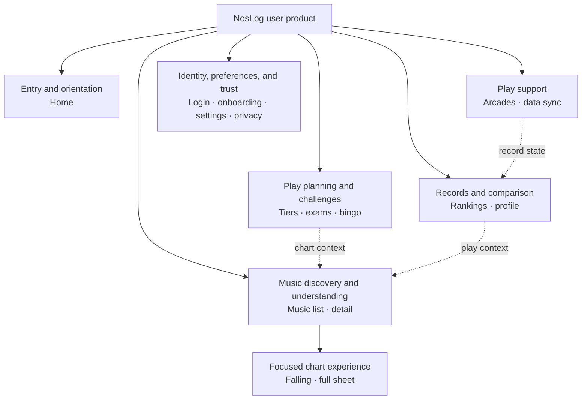

# NosLog 2.0 User Information Architecture and Navigation

## Document Control

- Status: `Draft for discussion`
- Evidence status: `Current-product audit, repository inspection, browser evidence, and cited navigation guidance`
- Date started: 2026-07-29
- Canonical language: English
- Korean companion:
  [02-information-architecture.ko.md](./02-information-architecture.ko.md)
- Input audit: [01-current-product-audit.md](./01-current-product-audit.md)
- Scope: User-facing NosLog 2.0 page families, information architecture,
  navigation, and important cross-page flows
- Excluded: Administrator-interface redesign, page-level visual composition,
  component styling, and final route migration

## Decision Labels

- **Confirmed:** Explicitly agreed with the user and usable as a downstream
  requirement.
- **Observed:** Verified from the current product, repository, or browser.
- **Proposed:** Recommended for discussion; not approved for implementation.
- **Open:** Requires research, testing, or a user decision.

No proposed navigation or grouping in this document is approved merely because it is
written here.

## Purpose

This document turns the v1.6.0 feature inventory into a user-centered structure before
page briefs or visual design begin. It must:

1. give every retained user-facing function a clear home;
2. distinguish page families from global-navigation destinations;
3. prioritize the most important tasks without deleting secondary functions;
4. define how users move between related pages;
5. expose unresolved navigation decisions before Figma or implementation work.

## Confirmed Inputs

- **Confirmed:** Home is the most important first-entry experience. It must help users
  understand where to go and obtain important information immediately.
- **Confirmed:** Music discovery and music detail form a primary, high-frequency
  journey.
- **Confirmed:** Tier lists are a primary play-planning journey.
- **Confirmed:** No existing user-facing function is currently scheduled for removal
  or deferral.
- **Confirmed:** Secondary functions may be regrouped or progressively disclosed, but
  their capability and discoverability must be preserved.
- **Confirmed:** Administrator-interface redesign is outside the NosLog 2.0
  user-facing scope and may be addressed after 2.0.
- **Confirmed:** Korean, Japanese, and English user routes retain locale-prefixed URLs.
- **Confirmed:** Mobile is the primary use context, while desktop remains a required
  responsive target.
- **Observed:** The chart viewer needs a different width and control model from normal
  content pages.

## Reference Basis

| Source                                                                                                                | Transferable principle                                                                                                     | NosLog application                                                                                                                                       | Limitation                                                                                         |
| --------------------------------------------------------------------------------------------------------------------- | -------------------------------------------------------------------------------------------------------------------------- | -------------------------------------------------------------------------------------------------------------------------------------------------------- | -------------------------------------------------------------------------------------------------- |
| [W3C WCAG 2.2: Multiple Ways](https://www.w3.org/WAI/WCAG22/Understanding/multiple-ways)                              | Users should have more than one way to locate content within a set of pages.                                               | Important music, tier, profile, and challenge destinations should be reachable through global navigation plus contextual links, search, or the home hub. | It does not prescribe a specific navigation component.                                             |
| [W3C WCAG 2.2: Consistent Navigation](https://www.w3.org/WAI/WCAG22/Understanding/consistent-navigation.html)         | Repeated navigation should remain in the same relative order.                                                              | Mobile and desktop may use different layouts, but destination meaning and relative order should remain predictable.                                      | Different focused contexts may use a deliberately reduced shell when documented and tested.        |
| [W3C WCAG 2.2: Consistent Identification](https://www.w3.org/WAI/WCAG22/Understanding/consistent-identification.html) | Repeated functions should use consistent labels and identification.                                                        | Search, sync, profile, chart-viewer, and navigation labels must remain semantically consistent across ko, ja, and en.                                    | Translation length may require different visual space without changing meaning.                    |
| [W3C WCAG 2.2: Bypass Blocks](https://www.w3.org/WAI/WCAG22/Understanding/bypass-blocks)                              | Repeated navigation must be bypassable for sequential navigation.                                                          | Preserve a skip link and semantic landmarks even if the navigation becomes richer.                                                                       | This is an accessibility requirement, not a visual layout recommendation.                          |
| [GOV.UK: Navigate a service](https://design-system.service.gov.uk/patterns/navigate-a-service/)                       | Navigation should link to the most useful top-level sections and should not become a site map.                             | The global NosLog navigation should expose a compact set of frequent destinations; all retained features do not need equal global prominence.            | GOV.UK is a public-service context, so its visual pattern is not a NosLog art-direction reference. |
| [Figma: UI design principles](https://www.figma.com/resource-library/ui-design-principles/)                           | Hierarchy and progressive disclosure should align visible priority with user need.                                         | Home modules and secondary utilities should be ordered by task importance instead of rendered at equal weight.                                           | The article provides principles rather than NosLog-specific evidence.                              |
| [Material Design: Understanding navigation](https://m2.material.io/design/navigation/understanding-navigation.html)   | A compact set of top-level mobile destinations can remain directly accessible while deeper destinations use another layer. | A four- or five-destination mobile model is a candidate to test, not a mandate.                                                                          | This is an older application-navigation reference and must not be copied as NosLog styling.        |

## Current Navigation Model

### Observed Global Surfaces

| Surface                   | Current destinations or role                                           | Current priority signal                                                                      |
| ------------------------- | ---------------------------------------------------------------------- | -------------------------------------------------------------------------------------------- |
| Brand link                | Home                                                                   | Home is available through the NosLog wordmark but is not named as a primary navigation item. |
| Primary header navigation | Music, rankings, tiers                                                 | Three destinations receive persistent direct access.                                         |
| Secondary menu            | Bingo, exams, arcades, data sync; administrator entry when authorized  | These functions require opening the menu.                                                    |
| User control              | Public profile through the signed-in avatar, or login while signed out | Identity and account access are visually separate from content navigation.                   |
| Home search               | Music discovery with the query carried to the music page               | The fastest current music-entry path.                                                        |
| Home shortcut grid        | Music, rankings, bingo, tiers, exams, arcades                          | Six functions receive nearly equal visual weight.                                            |
| Home utility row          | Data sync                                                              | Sync is separated from the shortcut grid but is always present.                              |
| Home lower content        | Feedback and official NOSTALGIA news                                   | Supporting content follows product shortcuts.                                                |
| Footer                    | Privacy and GitHub                                                     | Trust and external project information.                                                      |

### Observed Structural Symptoms

- Home does not yet express the confirmed difference in priority between music, tiers,
  and secondary functions because the six shortcut tiles have similar weight.
- Home is essential but is represented globally by the wordmark rather than a labeled
  destination.
- Rankings remains a current primary destination, but its future priority relative to
  home, profile/records, and the confirmed music/tier tasks is not yet decided.
- Data sync, feedback, and official news are useful but compete with core first-entry
  tasks when always shown as independent home blocks.
- The current secondary menu is a flat list rather than an explanation of how bingo,
  exams, arcades, and data sync relate to user goals.
- Music detail, tier entries, exam stages, profile records, and ranking entries already
  create contextual routes to music. These relationships are valuable and should not
  be replaced by global navigation alone.

## Proposed User Page Families

Page families group related user goals and screen templates. They are not automatically
global-navigation labels.

| Page family                       | User question or goal                                                   | Included routes and functions                                                                                                                | Proposed relationship                                                                |
| --------------------------------- | ----------------------------------------------------------------------- | -------------------------------------------------------------------------------------------------------------------------------------------- | ------------------------------------------------------------------------------------ |
| Entry and orientation             | “What can I do now, and what needs my attention?”                       | Home, announcements, global music search, contextual status, priority shortcuts, official news, feedback entry                               | Primary entry and orientation hub                                                    |
| Music discovery and understanding | “Which music am I looking for, and what do its chart and records mean?” | Music search/list, music detail, difficulty switching, chart information, personal record, chart ranking, evaluation, published chart viewer | Primary product family                                                               |
| Play planning and challenges      | “What should I play next, and what goal should I pursue?”               | Tier lists, exams, bingo list/detail, goal filters, simulations, missions, proof submission                                                  | Tier lists remain directly important; exams and bingo are related challenge branches |
| Records and comparison            | “How am I progressing, and how do I compare?”                           | Global rankings, public profile, grade/rating trends, best and recent plays, judgement analytics, public profile links                       | Cross-cuts music and play planning                                                   |
| Play support                      | “Where can I play, and how do I bring my records into NosLog?”          | Arcade discovery, preferred arcade, data-sync guide, token and sync state                                                                    | Secondary but essential operational support                                          |
| Identity, preferences, and trust  | “How do I enter, configure, and trust the service?”                     | Login, onboarding, profile settings, locale, localized-title preference, privacy, account deletion, maintenance, error and not-found states  | Utility and lifecycle family                                                         |
| Focused chart experience          | “How does this chart play over time?”                                   | Falling chart view, full-sheet view, local audio, playback controls, metronome, strict performance                                           | Specialized child context of music detail, not a global destination                  |

### Family Rules

- Every current user-facing route must belong to one primary family even if it has
  contextual links into several other families.
- A page family may contain multiple templates and states; it is not a promise that all
  pages share one layout.
- Music detail is the primary cross-link hub for a single chart.
- Tier, exam, profile, and ranking entries should preserve direct routes to the
  corresponding music detail where the data identifies a chart.
- The chart viewer remains a child of music, with a focused shell that may reduce
  ordinary global navigation while preserving orientation and a reliable return path.
- Legacy tier URLs remain compatibility redirects and are not navigation destinations.

## Proposed Structural Map

This map shows page-family relationships, not the final global-navigation component.

## Proposed Hierarchy

### Level 0: Service Shell

The repeated shell should provide:

- NosLog identity and a reliable route to home;
- a compact set of top-level destinations;
- signed-in profile or signed-out login access;
- access to secondary destinations and global preferences;
- a skip route to main content;
- stable navigation naming and order across localized pages.

### Level 1: Candidate Direct Destinations

The following destination order is **Proposed for testing**, not approved:

1. Home
2. Music
3. Tiers
4. Rankings
5. More

Rationale:

- Home, music, and tiers directly reflect the confirmed priority.
- Rankings preserves a current primary product function and the records/ranking focus
  of NosLog, but still requires confirmation against actual use.
- More prevents the global navigation from becoming a site map while preserving routes
  to challenges, play support, preferences, and trust content.
- Profile remains a stable identity control rather than changing a destination based
  on authentication state.

### Level 2: Candidate Secondary Groups

| Group                   | Candidate contents                          | Notes                                                                                                         |
| ----------------------- | ------------------------------------------- | ------------------------------------------------------------------------------------------------------------- |
| Challenges              | Exams, bingo                                | Both represent structured goals, but the final Korean/Japanese/English group label requires language testing. |
| Play support            | Arcades, data sync                          | These support arcade play and record acquisition rather than content discovery.                               |
| Account and preferences | Profile, settings, locale, title preference | Profile remains directly available through the avatar when signed in.                                         |
| Help and trust          | Feedback, privacy, service status, GitHub   | Feedback placement must remain consistent; privacy must remain directly findable.                             |

This grouping must not add an unnecessary intermediate page when a direct contextual
link is clearer.

## Home Information Architecture

### Confirmed Role

Home is an orientation and routing surface, not a miniature copy of every page.

### Proposed Priority Layers

1. **Service-critical notice:** show only when an announcement or service state
   materially affects use.
2. **Primary music search:** remain immediately available because music lookup is a
   high-frequency task.
3. **Contextual next action:** a signed-in state may show an actionable record/sync/play
   continuation; a signed-out state may explain the value of signing in without
   blocking public browsing.
4. **Primary destinations:** music and tiers receive stronger hierarchy than secondary
   functions.
5. **Records and challenges:** rankings, exams, and bingo remain discoverable as the
   next layer.
6. **Play support:** arcades and data sync appear contextually or in a supporting
   section.
7. **Editorial and support content:** official news and feedback remain available after
   core product tasks.

### Agreed Progressive-Disclosure Candidates

- **Data sync:** do not remove it. Consider a prominent contextual state when the user
  has never synced, has a stale sync, or has an error; otherwise keep a stable route in
  play support/profile and reduce permanent home prominence.
- **Feedback:** do not remove it. Consider a consistent support location rather than
  giving it the same hierarchy as a primary product task.
- **Official news:** do not remove it. Keep it as editorial content below the task-first
  home hierarchy unless research supports a stronger role.

The exact modules, content, personalization, and order remain open until the home page
brief is approved.

## Important User Flows

| Flow                          | Entry                                             | Required sequence                                                          | Success condition                                                                                          | Important recovery or branch                                                           |
| ----------------------------- | ------------------------------------------------- | -------------------------------------------------------------------------- | ---------------------------------------------------------------------------------------------------------- | -------------------------------------------------------------------------------------- |
| Find a chart quickly          | Home search or global Music                       | Search/filter → result → music detail → difficulty/tab                     | User reaches the correct music/chart information with the original and selected localized title understood | No results, ambiguous title, unavailable difficulty, signed-out personal-record prompt |
| Choose what to play by tier   | Home or global Tiers                              | Select mode/goal → inspect band → select chart → music detail              | User identifies an appropriate next chart and can inspect their record                                     | No published list, missing personal record, filter empty state                         |
| Review progress               | Profile avatar or Rankings                        | Profile/ranking → summary or entry → music detail                          | User understands current standing or record and can inspect supporting plays                               | Private field, signed-out state, no plays, ranking request error                       |
| Pursue a structured challenge | More/home context → Exams or Bingo                | Select challenge → inspect requirements → chart/mission → update or submit | User understands the next requirement and current completion state                                         | Login required, unavailable event, incomplete proof, validation or upload error        |
| Establish or recover sync     | Contextual home/profile state or More → Data sync | Understand state → install/run bookmarklet → inspect result → profile      | User knows whether records are current and what changed                                                    | Token regeneration, processing, stale, partial, failed, or no-history state            |
| Inspect chart playback        | Music detail → Chart viewer                       | Enter focused viewer → choose falling/full sheet → configure/play → return | User can understand chart timing and hand/path behavior without losing context                             | Unpublished chart, local audio absent, narrow viewport, playback error                 |

## Cross-Link Requirements

- Music must be reachable through global navigation, home search, and contextual chart
  links from tiers, exams, profile plays, and rankings where data permits.
- Tiers must be reachable through global navigation, home hierarchy, and relevant music
  detail context.
- Profile must be reachable through the signed-in identity control and public user links.
- Data sync must be reachable from a stable secondary location and from contextual
  status prompts when action is required.
- Privacy must be reachable without authentication and from account-destructive
  decisions.
- No retained page may become an orphan that depends on a remembered URL.

## Responsive Navigation Models for Decision

### Option A: Persistent Mobile Bottom Navigation

Ordinary user pages use a bottom bar with Home, Music, Tiers, Rankings, and More.

**Advantages**

- Confirmed primary tasks remain visible and one-handed.
- Home becomes an explicit destination.
- Destination order can remain stable across pages.

**Risks**

- Competes with mobile browser chrome, safe-area space, long-page content, and viewer
  playback controls.
- Requires careful focus order, active-state semantics, translated labels, and scroll
  padding.
- Secondary destinations remain behind More.

### Option B: Compact Top Header

The top header exposes Home/brand, Music, Tiers, selected additional destinations, and
a menu/profile control.

**Advantages**

- Preserves the lower viewport for content and playback controls.
- Evolves the current interaction model with less shell complexity.
- Can expand naturally at desktop widths.

**Risks**

- Frequent destinations are less reachable one-handed.
- Hiding the header on scroll can temporarily remove all navigation.
- Small widths constrain translated labels and identity controls.

### Option C: Ordinary-Page Navigation Plus Focused Viewer Shell

Use a stable navigation model for ordinary pages, but give the chart viewer a documented
focused shell with back, chart identity, and essential viewer controls.

**Advantages**

- Acknowledges that chart playback is a distinct interaction context.
- Prevents global navigation from competing with the piano, canvas, seek bar, and
  playback controls.
- Can be combined with either Option A or B for ordinary pages.

**Risks**

- Requires a clear return path and preserved state.
- Must not make the viewer feel like a different service.
- Accessibility testing must verify landmarks, focus entry/return, and orientation.

### Initial Recommendation

**Proposed:** Test Option A for ordinary mobile pages together with Option C for the
chart viewer. Test an expanded top navigation at desktop widths while preserving the
same destination meaning and relative order.

This recommendation requires user approval and representative prototypes. It does not
authorize implementation.

## Desktop Adaptation Principles

- Do not retain the current centered 390px shell as the general desktop architecture.
- Preserve the same information hierarchy and destination naming used on mobile.
- Use additional width for comparison, filtering, record analysis, and related context,
  not merely larger cards or larger empty margins.
- Keep a clear primary content column even when secondary panels are introduced.
- Do not create a separate desktop-only feature taxonomy.
- The focused chart viewer may use substantially more width than ordinary reading
  pages.

## Localization and Accessibility Requirements

- Validate every global and secondary navigation label in Korean, Japanese, and English.
- Do not change a destination's meaning only to make a translation shorter.
- Repeated navigation keeps the same relative order across the pages of each locale.
- Current-page state uses semantic `aria-current` or the appropriate equivalent.
- Menus expose name, role, expanded state, controlled content, Escape behavior, and
  predictable focus return.
- A skip link and a single page-level `main` landmark remain required in ordinary pages.
- The chart viewer must eliminate the currently observed nested `main` landmarks.
- Interactive targets must meet WCAG 2.2 minimum target-size or spacing requirements;
  frequent mobile destinations should aim larger than the minimum.
- Visual reordering at wider widths must not create an illogical reading or focus order.

## URL and Routing Position

- **Confirmed:** Continue locale prefixes: `/ko`, `/ja`, and `/en`.
- **Proposed:** Preserve current user route slugs during the first design milestone
  unless a route prevents the agreed hierarchy or creates a clear usability problem.
- **Proposed:** Treat `/tiers/[slug]` as compatibility behavior, not an exposed IA node.
- **Open:** Decide whether any future grouping needs visible landing pages or only
  navigation-menu grouping.
- Any route change must include redirect, canonical, shared-link, localization, and
  analytics consequences before approval.

## Decision Register

| ID    | Decision                                | Recommendation                                                                  | Status     |
| ----- | --------------------------------------- | ------------------------------------------------------------------------------- | ---------- |
| IA-01 | Ordinary mobile global-navigation model | Test bottom navigation with Home, Music, Tiers, Rankings, More                  | `Open`     |
| IA-02 | Chart-viewer shell                      | Use a focused viewer shell with a reliable return path                          | `Open`     |
| IA-03 | Rankings global priority                | Retain as a direct destination for the first prototype, then validate           | `Open`     |
| IA-04 | Home signed-in personalization          | Show only a small actionable next-state module, not a dashboard clone           | `Open`     |
| IA-05 | Data-sync placement                     | Contextual prominence when action is required; stable secondary route otherwise | `Proposed` |
| IA-06 | Feedback placement                      | Stable support location outside the primary-task hierarchy                      | `Proposed` |
| IA-07 | Official-news placement                 | Editorial content after core product tasks                                      | `Proposed` |
| IA-08 | Secondary grouping label                | Test challenge, play-support, account, and trust group labels in all locales    | `Open`     |
| IA-09 | General desktop navigation              | Expand the ordinary-page navigation without changing semantic order             | `Open`     |

## Questions for User Review

1. Should the first mobile prototype test a persistent bottom navigation with
   **Home, Music, Tiers, Rankings, More**, or should ordinary pages retain a top-only
   navigation?
2. Should the chart viewer use a focused shell without the ordinary global navigation,
   as long as it preserves a clear back route and the current music/chart identity?
3. On the signed-in home, should NosLog show one contextual next action such as stale
   sync, recent play, or unfinished challenge, or should home remain identical for
   signed-in and signed-out users except for the account control?
4. Is it acceptable to group bingo and exams under a challenge concept while keeping
   tier lists directly accessible?
5. Should rankings remain a direct global destination in the first prototype, even
   though home, music, and tiers have the explicitly confirmed highest priority?

## Acceptance Criteria for This Artifact

- Every retained user route is assigned to one primary page family.
- No verified feature disappears from the page-family map or cross-link requirements.
- Home, music, and tiers receive explicit first-class treatment.
- Administrator redesign is not mixed into the user-facing navigation model.
- Proposed and confirmed decisions are visibly distinguished.
- Important flows include success and recovery branches.
- Mobile and desktop use the same semantic hierarchy even if their navigation
  components differ.
- Korean, Japanese, and English constraints are included before labels are finalized.
- The user approves the open decision register before page briefs begin.

## Next Actions

1. Review and resolve IA-01 through IA-09 with the user.
2. Revise the page-family map and flows from those decisions.
3. Mark this artifact approved when no material IA uncertainty remains.
4. Create page briefs in priority order: home, music discovery, music detail, tiers,
   then the remaining page families.
